<!-- _footer: "" -->

# Common Pool Resources

*Static, Dynamic, Intergenerational and Spatial Perspectives*

**Dimitri Dubois**  

📧 dimitri.dubois@umontpellier.fr

*CEE-M, Univ. Montpellier, CNRS, INRAE, Institut Agro.*

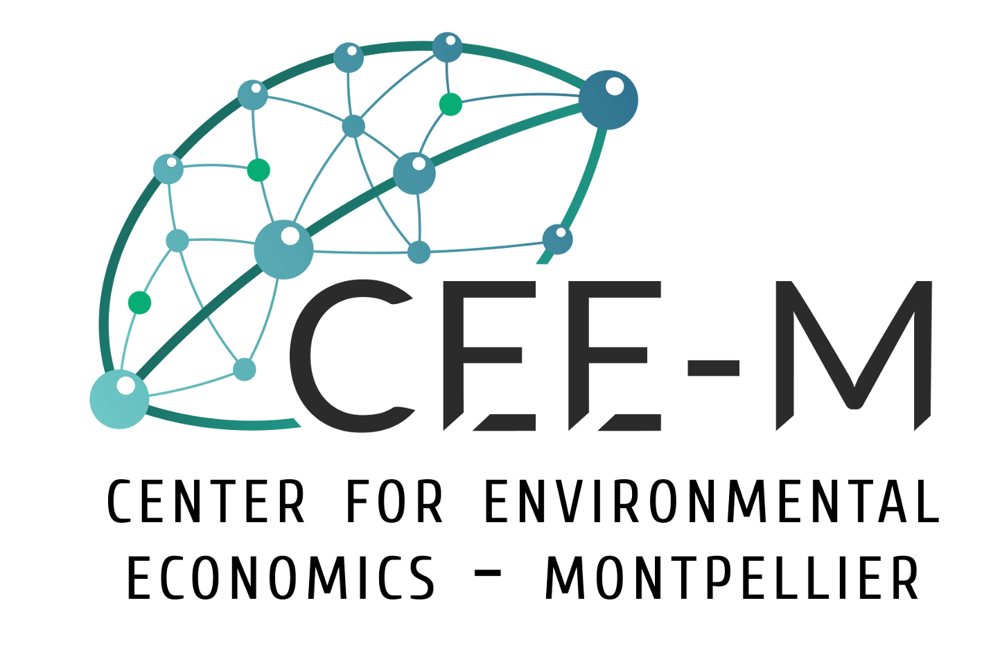

---

## Table of content

1. [Static CPR](#static-common-pool-resource)
  1.1. [The Game](#the-game)
  1.2. [Voluntary Information Sharing](#voluntary-information-sharing)
  1.3. [Quality of Relationships within groups](#quality-of-relationships-within-groups)
2. [Dynamic CPR](#dynamic-common-pool-resource)
  2.1. [Theoretical Model](#theoretical-model)
  2.2. [Implementation in the lab](#implementation-in-the-lab)
  2.3. [Continuous vs. discrete time](#continuous-vs-discrete-time)
  2.4. [Impact of discounting reference periods](#impact-of-discounting-reference-periods)
  2.5. [Individual and strategic behaviors](#individual-and-strategic-behaviors)

--- 

3. [Intergenerational CPR](#intergenerational-management-of-common-pool-resources)
  3.1. [The Intergenerational Goods Game (IGG)](#the-intergenerational-goods-game-igg)
  3.2. [Intragenerational vs. intergenerational social dilemma](#intragenerational-conflict-undermines-cooperation-with-the-future)
  3.3. [Framing the future for sustainability](#legacy-or-lineage-framing-the-future-for-sustainability)
4. [Dynamic CPR with Spatial Externalities](#dynamic-common-pool-resource-with-spatial-externalities)
  4.1. [Theoretical Benchmark](#theoretical-benchmark)
  4.1. [Spatial Externalities and Collective Action](#spatial-externalities-and-collective-action)
  4.2. [Property Rights and Productivity](#property-rights-and-productivity)

---

🌐 <https://www.duboishome.info/dimitri/cours/topics>

---

# Introduction

---

## Goods classification

Depends on two characteristics: **Rivalry** and **Excludability**.

- **Private Goods**: Both excludable and rival, meaning people can be excluded from using them, and one person's use diminishes availability for others.
- **Club Goods**: Excludable but non-rival, allowing limited access without overuse issues.
- **Public Goods**: Neither excludable nor rival, accessible to everyone without reducing availability.
- **Common Pool Resources**: Non-excludable but rival, making them susceptible to overuse and depletion. 

---

| Type of Good | Rivalry | Excludability | Examples |
|---|---|---|---|
| **Private Goods** | High | High | Food, clothing, personal devices |
| **Club Goods** | Low | High | Cinemas, private parks, toll roads |
| **Public Goods** | Low | Low | National defense, air, public parks |
| **Common Pool Resources** | High | Low | Fisheries, groundwater, forests |

---

## Common Pool Resources (CPRs)

- CPRs are subject to the **Tragedy of the Commons** (Hardin 1968), that leads to over-extraction and depletion of the resource.
- Individuals acting in their **own self-interest** can lead to collective ruin, as each user has an incentive to extract as much as possible, disregarding the long-term sustainability of the resource.

---

- This tragedy is not inevitable, as shown by **Ostrom**'s work on economic governance of the commons.
- Behavioral and experimental economists have also made contributions and found mechanisms that can help to mitigate the tragedy and reduce the over-exploitation, like **communication, sanctions, property rights, regulation/quotas or nudges**.

---

## CPR Model

- The basic CPR model involves a **group of individuals who have access to a shared resource**.
- Each individual can choose **how much of the resource to extract**, but the total extraction by all individuals affects the overall availability of the resource.
- The model typically includes a **payoff function** that captures the benefits and costs associated with extraction.
- *The goal is to understand how individuals make decisions about extraction and how these decisions impact the sustainability of the resource over time*.

---

# Static Common Pool Resource

---

## The Game
*Walker, Herr, Gardner & Ostrom (2000)*

- **Variables**:
  - $x_i$: Individual extraction
  - $X = \sum_{j=1}^n x_j$: Total group extraction

- **Benefit Function**:
  - $B_i(x_i) = a x_i - b x_i^2$
    - $a$: Initial benefit per unit extracted
    - $b$: Diminishing returns parameter

---

- **Cost Function**:
  - $C_i(x_i, X) = x_i (c + kX)$
    - $c$: Base cost of extraction
    - $k$: Marginal cost linked to total extraction (captures negative externality)

- **Individual Payoff**:
  $$
  \pi_i(x_i, X) = a x_i - b x_i^2 - x_i(c + k X)
  $$

> *Each player chooses $x_i$ to maximize their own payoff, but total extraction $X$ increases costs for everyone, creating a social dilemma.*

---

### Nash Equilibrium

Each player maximizes their own payoff given the others’ decisions:
$$
\max_{x_i} \ \pi_i(x_i, X_{-i}) = a x_i - b x_i^2 - x_i (c + kX)
$$

where $X = x_i + X_{-i}$

First-order condition (FOC): $a - 2b x_i - c - kX = 0$

Assuming symmetry $x_i = x$, $X = nx$:
$$
x_i^{Nash} = \frac{a - c}{2b + k(n+1)}
$$

---

### Social Optimum

Maximize total group payoff $\Pi = \sum_{i=1}^n \pi_i$

$
\max_{x_1, \dots, x_n} \ \sum_{i=1}^{n} \left(a x_i - b x_i^2 - x_i (c + kX)\right)
$

Under symmetry $x_i = x$, $X = nx$, becomes:
$$
\max_{x} \ n\left(a x - b x^2 - x(c + knx)\right)
$$

FOC: $a - 2b x - c - 2knx = 0$
$$
x_i^{Social} = \frac{a - c}{2b + 2kn}
$$

---

- *NE*: players ignore the negative effect of their extraction on others.
- *SO*: players internalize the group-level externality and extract less.

---

With $a = 0.383$, $b = 0.001$, $c = 0.005$, $k = 0.005$, $n = 4$:
- $x_i^{Nash} \approx 14$ tokens
- $x_i^{Social} \approx 9$ tokens

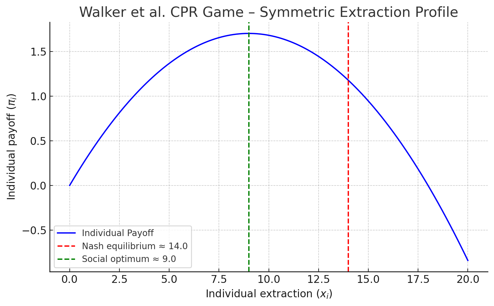

---

## Voluntary Information Sharing

Dubois, D., Farolfi, S., Rouchier, J. & Nguyen Van, P., 2020. "[Contrasting effects of information sharing on CPR extraction behaviour: experimental findings](https://journals.plos.org/plosone/article?id=10.1371/journal.pone.0240212)". Plos One 15 (10): e0241212.

---

- **Social information** — the information available to participants about others' actions — is crucial for common resource management.
- Most participants are **conditional cooperators** (Fischbacher et al. 2001), highlighting the potential influence of social information on cooperative behavior.
- **Aggregate information** about group decisions has been shown to increase contributions in public goods games. Adding **individual (anonymous) contributions** can further boost cooperation (Sell & Wilson, 1991).

---

- However, detailed information about others' actions can decrease cooperation, as it may reveal **free riders** within the group (Nikiforakis, 2010; Villena & Zecchetto, 2010).
- **Mixed impact of social information**: While some forms enhance cooperation, others can undermine it by exposing non-cooperative behavior.
- **Modern connected devices and social networks** facilitate information exchange, enabling real-time sharing of consumption and resource extraction data.

---

### Research question

***Investigate the impact of social information through voluntary sharing mechanisms on cooperative behavior in common-pool resources.***

---

Two Mechanisms of Information Sharing:
- **Voluntary Disclosure (VD)**: Stakeholders choose whether to disclose their extraction level.
- **Free Disclosure (FD)**: Stakeholders choose whether to disclose *and can determine the extraction level they display* (which may differ from the actual level).

---

### A Simplified CPR Game

- $4$ players and a shared resource of $40$ tokens.
- Each player $i$ chooses an extraction level $x_i \in [0, 10]$.

- **Individual payoff function**:
    $\pi_i(x_i, X) = 3x_i - 0.01875 \cdot X^2$
  where $X = \sum_{j=1}^4 x_j$ is the total group extraction.

- **Key features**:
  - The benefit is linear.
  - The cost is quadratic and shared.
  - The externality is global and symmetric.

---

- **Dominant strategy**:
  - Each player maximizes own payoff by choosing the maximum  $x_i = 10$ (Nash equilibrium).
  
- **Social optimum**:
  - Total group payoff is maximized when $X = 20$, i.e. $x_i = 5$ for each player.

> Captures the essence of CPR dilemmas:
> Private incentives lead to overuse, while collective interest requires restraint.

---

### Experimental Design

- CPR game played **20 rounds** in fixed **groups of 4** participants.
- 3 treatments, following a between-subject design:
    - **_Mandatory Disclosure (MD)_**: individual extractions are disclosed in an automatic and mandatory manner
    - **_Voluntary Disclosure (VD)_**: after making their extraction decision, the players have to decide whether or not they wish to make this extraction decision public
    - **_Free Disclosure (FD)_**: after making their extraction decision, players have to decide whether or not they wish to make their extraction level public, as well as additionally deciding the amount of extraction they wish to publicize
 
---

|                          | MD | VD | FD |
|--------------------------|----|----|----|
| **Voluntary sharing**    | No | Yes | Yes |
| **Freedom to choose the value to be disclosed** | No | No  | Yes |

---

### Conjectures

**Conjecture 1**: Individuals disclose extractions frequently due to:
- Desire to signal cooperation (warm-glow effect).
- Perception of a "socially appropriate" extraction level and descriptive norm.

**Conjecture 2 (Voluntary Disclosure)**:
1. **Disclosed extractions** < **Non-disclosed extractions**.
2. **Average extractions** < **Mandatory Disclosure**.
   - Non-cooperators avoid making extractions public to limit influence on others.
   - Guilt or shame can deter non-prosocial behavior.

---

**Conjecture 3 (Free Disclosure)**:
1. **Disclosed extractions** < **Non-disclosed extractions**.
2. **Disclosed extractions** < **Actual extractions**.
3. **Average extractions** < **Mandatory Disclosure**.
   - Cooperators likely to disclose accurate extractions; non-cooperators may hide actual values.
   - Some may signal optimal extractions to set a group norm.
   - Strategic false disclosures may erode trust, hindering norm formation and conditional cooperation.

---

### Results
#### Average extraction

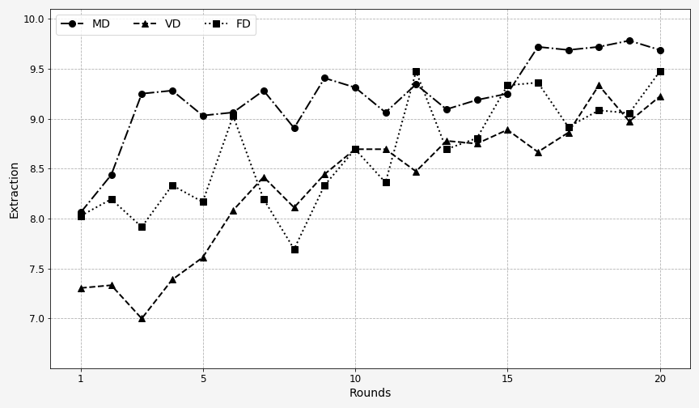

---

**Information sharing is effective in reducing extraction**:

- Average extractions in MD significantly higher than in VD and FD
- No significant difference between VD and FD

---

#### Effect of Disclosure

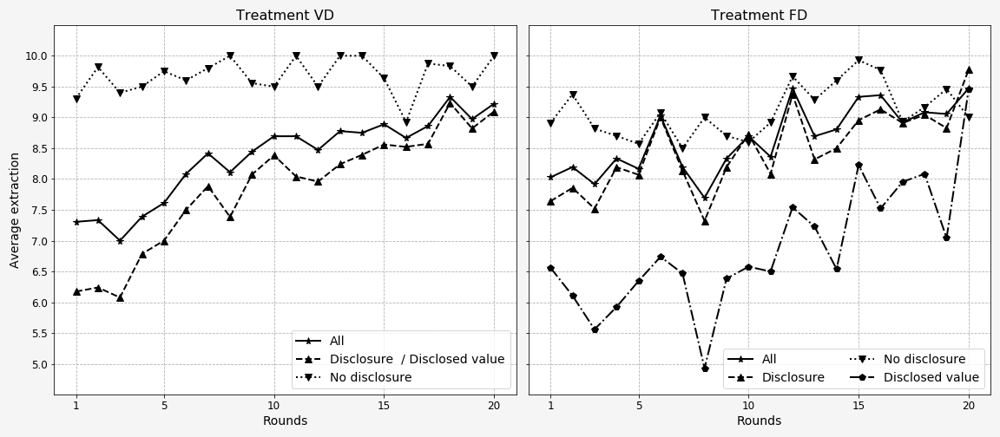

---

- ***Players who disclosed their extraction decision extracted less than non-disclosers***.
- **VD Treatment**: 
   - Overall average and average of disclosed extractions (displayed values) are closely aligned.
   - This alignment supports expected effects of social information: imitation, convergence of decisions, and norm formation within groups.
- **FD Treatment**:
   - A significant discrepancy between average displayed extractions and actual extractions.

---

#### Strategic Misreporting in the FD Treatment

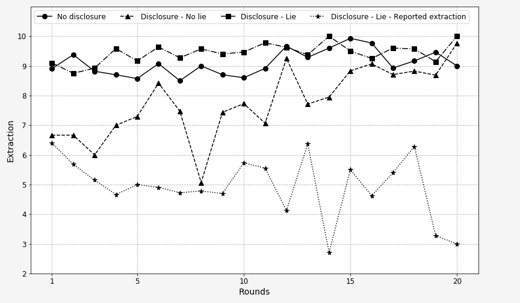

---

- **Strategic Misreporting**: Players who misrepresented their extraction level extracted significantly more than those who reported their actual extraction or chose not to disclose.

- **Understanding of Social Optimum**: These players appeared to recognize the social optimum (5 units) as a target extraction level.
- **Emergence of Strategic Behavior**:
   - The freedom to selectively disclose favored strategic reporting.
   - Players sent misleading signals by reporting extractions near the social optimum, anticipating that others might reduce their own extraction, thus allowing the misreporters to maximize their profit.

---

### Findings and implications

**Effects of social information are mixed**:
    
- **Voluntary Disclosure**: Tends to **encourage cooperative actions** and more sustainable resource use. Cooperative players disclose their actions, while less cooperative players often choose not to disclose to avoid influencing others negatively. This **selective disclosure can foster a cooperative norm** by highlighting lower extractions without spreading non-cooperative behavior.
- **Free Disclosure**: Allows **strategic manipulation** of shared information. Less cooperative players can misrepresent their extractions, signaling a low, socially optimal level, while actually extracting more. This behavior can erode trust, hinder the formation of a social norm, and potentially hasten resource depletion.

---

**Implications**:

- Voluntary disclosure can help align actions with cooperative norms when individuals selectively disclose honest information.
- Free disclosure, however, may undermine group trust and lead to over-exploitation, as selective false reporting can mislead others and disrupt cooperative intentions within the group.

---

## Quality of Relationships within groups

Brugnach, M., Dubois, D. & Farolfi, S.,"The Power of Bonds: How the Quality of Relationships Within a Group Can Drive Collective Actions in Common Pool Resource Management"

---

### Research question

***Does the quality of relationships within a group impact collective management of common pool resources (CPRs)?***

- Relationships shape collective actions in social dilemmas.
- Managing CPRs benefits from cooperative actions which could be influenced by social ties and relational quality.

>Strong, positive relationships within a group are likely to foster cooperation and responsible resource extraction.

---

### Challenge: building relationships within a group in the Lab

We developed an **effort task** (counting ones in 10x10 grids of zeros and ones) with three different payoff schemes to shape relational quality:

- **Individualistic** (control treatment): Each player is paid based on their own performance.
- **Cooperative** (promotes positive relational quality): Each player is paid based on the best performance within the group.
- **Competitive** (likely reduces relational quality): Only the player with the highest performance is paid; others receive nothing.

---

In all three conditions:
- Players shared **the same 100 grids**, displayed upon clicking numbers from 1 to 100.
- **Communication was allowed** in each condition.
- The task had a duration of **3 minutes**.

---

**The effort task**

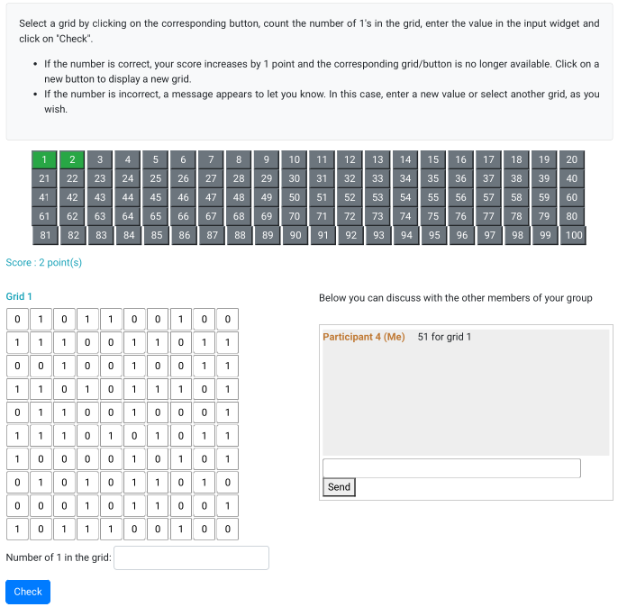

---

### CPR Game

**Walker, Herr, Gardner, and Ostrom (2000)**'s game for 4 players, repeated for 10 rounds.

- NE: 14 tokens  
- SO: 9 tokens
- Conditions:  
    - **Without Communication**  
    - **With Pre-Play Communication**: 3 minutes of chat before the first round.

---

### Questionnaire on Relational Quality

To evaluate **relational quality** within groups, a detailed questionnaire was administered:

- Emotional Experience
- Personal Feelings
- Behavioral Attitudes:
  - *Towards Others*: participants' behaviors toward fellow group members.
  - *Perceptions of Others*: participants’ views on others' behaviors within the group.
- Closeness-to-Others: Using the *Inclusion of Other in Self (IOS)* scale (Gächter et al. 2015) to assess perceived closeness within the group.

---
Inclusion of Other in Self (IOS)

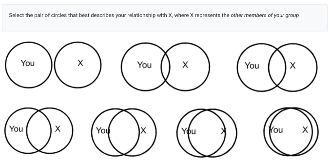

---

### Experimental design and hypotheses

- Flow of the experiment: Effort task, questionnaires, CPR Game (10 rounds), Questionnaires.
- Between-subject design
- 248 participants
    - 88 in treatment Individualist (48 w/o comm. and 40 with)
    - 80 in treatment Cooperation (44 w/o comm. and 36 with)
    - 80 in treatment Competition (44 w/o comm. and 36 with)

---

**_Hypotheses_**
- H1 : **Cooperative effort task enhances relational quality**, while competitive task diminishes it.
- H2: **Higher relational quality leads to better management** of CPRs; lower relational quality worsens CPR outcomes.

---

### Results

#### Link between effort task and responses to the questionnaire

1. **PCA analysis** to identify main components of the questionnaire (44 variables)
    - To reduce questionnaire responses into key components for understanding relational quality.
    - Top components reveal underlying factors.

---

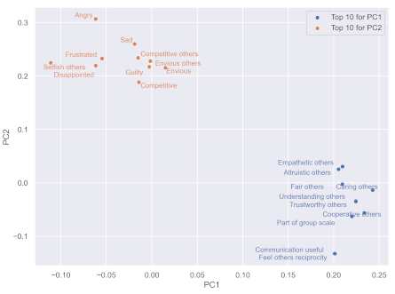

---

**Players' coordinates on main axes by treatment**

- Visualization of player distributions on principal axes based on treatment (Individualistic, Cooperative, Competitive).
- Objective: To examine if the treatments correlate with distinct relational patterns identified in the PCA.

---

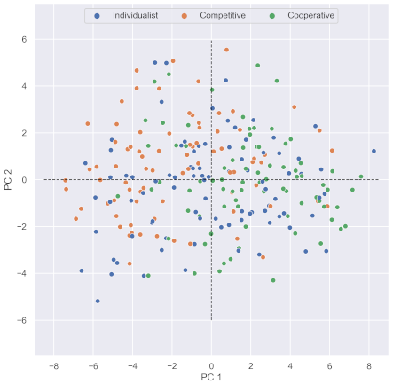

---

2. **K-Means clustering** of questionnaire responses:
   - Identify distinct clusters of player experiences, recognizing that emotions and perceptions may vary by individual performance and group communication dynamics.
   - Elbow method and Silhouette score indicated 2 optimal clusters.

---

**Cluster Visualization on PCA Components**  
Player distributions by clusters across main PCA axes.

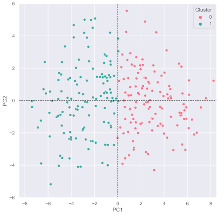

---

- **Cluster-0**: Mostly cooperative task participants (59/124), with balanced individualist participants (41/88).
- **Cluster-1**: Primarily competitive task participants (56/124) and the remaining individualist participants (47/88).

---

#### Impact of Group Composition on CPR Management

Analyze CPR extraction behavior in relation to **group composition based on clusters**.
  
**Group Composition Types**:
  - Defined by **cluster labels** assigned to each participant (Cluster-0 or Cluster-1).
  - Each group (4 players) categorized into three types:
    - **Maj. 0**: Majority of Cluster-0 participants (26 groups)
    - **Maj. 1**: Majority of Cluster-1 participants (25 groups)
    - **Mix**: Equal representation of Cluster-0 and Cluster-1 (11 groups)
  
This classification allows us to study how **relational quality** impacts CPR management, testing hypothesis H2.

---

**Evolution of average CPR extraction depending on group composition**

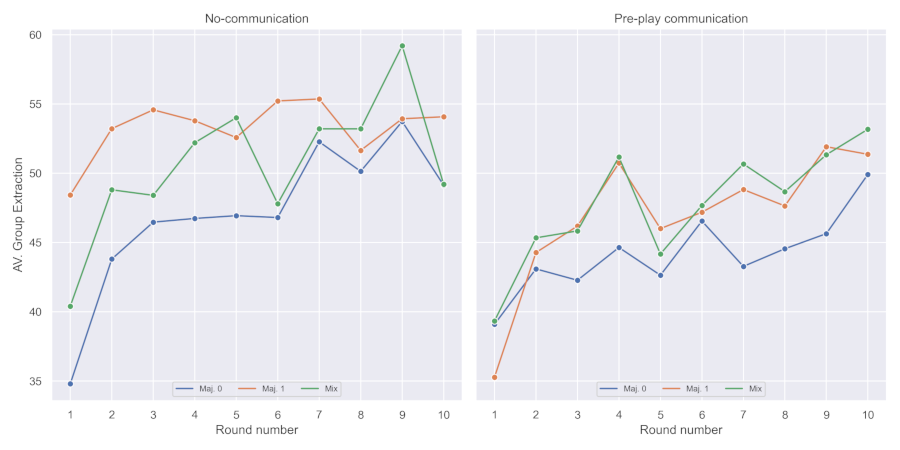

---

### Findings and Implications

- Developed an experimental mechanism to induce diverse relational qualities.
- Group composition —based on clusters analysis— impacted CPR management more than treatments alone.
- Communication notably reduced CPR extractions.

---

# Dynamic Common Pool Resource

---

- CPRs have mainly been studied in a **static framework**: the resource is assumed to be fixed and unchanging over the course of the game. Players make decisions about how much to extract from the resource but theses decisions do not affect the future availability of the resource.
- However in reality **many CPRs are dynamic** : they regenerate over an infinite horizon of time and the extraction decisions made by players can affect the future availability of the resource.

---

## Theoretical Model

Based on **Rubio & Casino (2003)**

- Linear quadratic model in which two agents $i$ and $j$ exploit a renewable resource $H$, the resource can be assimilated to a groundwater
- Extraction from the resource generates a revenue $B(w) = aw -\frac{b}{2}w^2$
- Extraction has a cost $C(H, w) = max(0, c_0-c_1H)w$
    - The cost depends negatively on the level of resource $H$
    - The cost is positive when the resource level is lower than $\frac{c_0}{c_1}$ and null if equal or higher. This a piecewise function to avoid subsidy in case of a high level of resource

---

In the infinite horizon, the total discounted payoff is given by

$\int_{0}^{\infty}e^{-rt} \left[ aw_i(t)-\frac{b}{2}w_i(t)^{2}-\max (0,\; c_{0}-c_{1}H(t))w_i(t) \right]dt$

with $\dot H(t)=R-\alpha(w_i(t)+w_j(t))$

$e^{-rt}$ is the discount factor ($r$ is the discount rate), $R$ is the natural recharge and $\alpha$ is the return flow coefficient.

**Each player's extraction reduces the resource level, affecting not only their own future payoffs but also the other player's future payoffs**. This interdependence of decisions and outcomes, inherent in CPRs, is incorporated into this dynamic equation.

---

### Theoretical Paths

**3 benchmarks**

- **Social optimum**: both players in the pair maximize the joint discounted net payoffs and maintain the resource at an efficient level (cooperative solution)
- **Feedback**: players maximize their own discounted net payoffs, they adopt a non-cooperative strategy
- **Myopic**: at each instant players maximize their current payoff regardless of the evolution of the resource

---

Choice of parameters such that theoretical paths are disctincts : $H_0=15, R=0.56, a=2.5, b=1.8, c_0=2, c_1=0.1, r=0.005, \alpha=1$

---

## Implementation in the lab
### Time in the lab

**Continuous time**
- Extractions can be made at any instant and the resource evolves continuously.
- Strict continuous time is not feasible in the lab, it's necessary to discretize the model with a small discretization rate.

**Discrete-time**  

In discrete time, extractions are made at specific intervals and the resource evolves from one interval to the next.

---

### Infinite Horizon in the lab

- Incorporated into Players' Payoff Calculations: Models long-term impact by combining cumulative and future payoffs:
  - *Cumulative Discounted Payoff*: Sum of payoffs from $t=0$ to $t=p$.
  - *Future Discounted Payoff*: Projected payoff from $t=p$ to $t=\infty$ based on a steady extraction rate.
- Encourages players to consider sustainable extraction rates by making long-term consequences more salient.

---

## Continuous vs. discrete time

Djiguemde, M., Dubois, D., Sauquet, A. & Tidball, M., 2022. "[Continuous Versus Discrete Time in Dynamic Common Pool Resource Game Experiments](https://doi.org/10.1007/s10640-022-00700-2)". Environmental and Resource Economics 82, pp. 985-1014.

---

### Research question

***Does the nature of time (continuous vs. discrete) affect behavior in a dynamic common pool resource game?***

>*Theoretical models often assume continuous time for dynamic CPRs, but experiments typically use discrete time.*

---

- Two models, one in continuous time and one in discrete time, with similar theoretical paths.
- Continuous-time (CT): discretization rate $\tau=0.1$
- Discrete-time (DT): discretization rate $\tau=1$
- A total **play time of 10 minutes** in both treatments:
  - CT: **600 seconds**, where 1 second = 0.1 instant in the model.
  - DT: **60 periods**, with 10 seconds per period → 1 period = 1 instant in the model.
  - Both treatments involved **60 model instants** of play.

---
### Interface

Continuous time
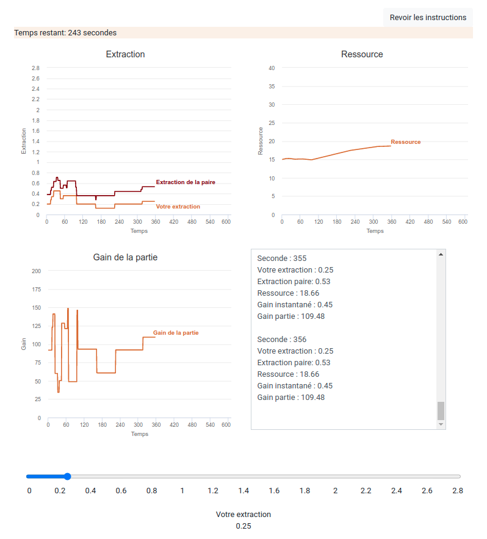

---

Discrete time
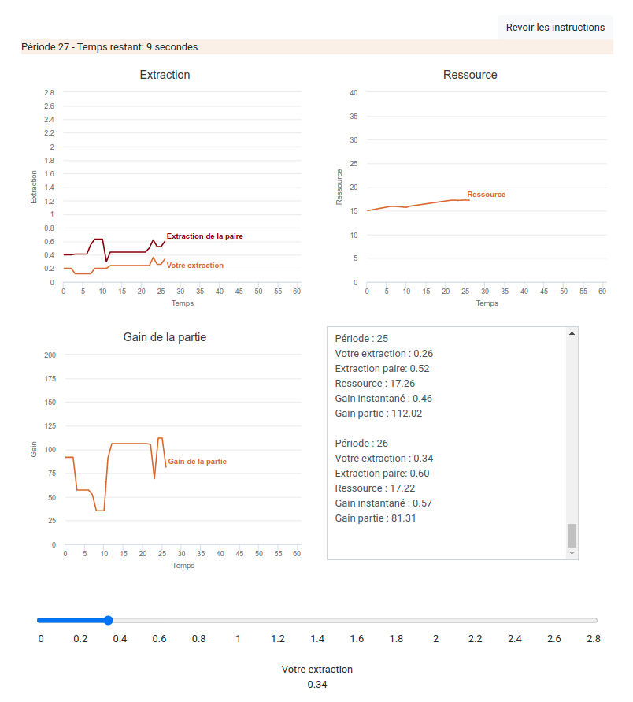

---

### Experimental Design

- Between subject design
- Two scenarios:
  - Optimal control (single player extracting from the resource)
  - Game (two players extracting from the same resource)
- A total of 392 participants.
  - Optimal control: 202 participants: 104 in CT and 98 in DT.
  - Game: 190 participants: 49 pairs in CT and 46 pairs in DT.

---

### Results
*Evolution of the average resource level over time*

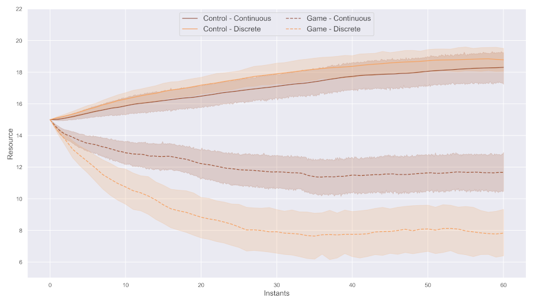

---

- The resource increases in the optimal control (single player) scenario, but decreases as soon as strategic interaction is introduced.
- The nature of time does not significantly affect player behavior in the optimal control scenario but does in the game scenario.

---

**In the game**

- In the continuous-time treatment, **players adjust their extraction rates more frequently and in smaller increments** compared to the discrete-time treatment.
- In the CT treatment, players were more likely to use a ***"tit-for-tat" strategy***, where they would match the extraction rate of the other player. In the DT treatment, players were more likely to use a ***"best response" strategy***, where they would adjust their extraction rate based on the other player's previous extraction rate.
- Final payoffs are ***more unequally distributed in the DT treatment*** compared to the CT treatment.

--- 

### Findings and implications

- The ***nature of time matters when the common pool resource is played with strategic interactions between stakeholders***.
- This study also makes a significant methodological contribution. We proposed a novel methodology for testing continuous-time models in a laboratory setting, despite the inherent discrete nature of such implementations. This approach allows for a more accurate representation of continuous-time dynamics and provides a framework for future experimental studies in this area.

---

## Impact of discounting reference periods

Davin, M., Dubois, D., Erdlenbruch, K. & Willinger, M., 2025. "[Discounting and extraction behavior in continuous time resource experiments](https://doi.org/10.1016/j.reseneeco.2025.101531)". Resource and Energy Economics 84.

---

### Research question 

***How different discounting periods affect behavior in a resource extraction experiment.***

In dynamic games, **discounting is typically based on a reference period**.

- Theory: discounting is done at **time zero**, where agents choose optimal paths.
- Experiment: participants continuously adapt their extraction strategies → the **present time may be more relevant for discounting**.

>**Theory suggests no difference** in optimal behavior based on the discounting reference period. However, **if subjects revise their extraction plans**, discounting period reference may influence decisions.

---

- We compare two discounting methods in a continuous-time resource extraction game:
  - **z-Discounting**: Gains are discounted at the initial time (time zero).
  - **p-Discounting**: Gains are discounted at the current time (present time).
- Both methods yield the same theoretical optimal extraction path.
- However, they lead to different **perceived gains** at any given time, which may influence behavior.

*Note: in both cases we implement infinite horizon with the scrap value method, i.e. the future discounted gains are calculated assuming a constant extraction rate equal to the last extraction rate.*

---

### Difference Between z-Discounting and p-Discounting Gains

For a given payoff function $G(E_t, R_t)$, where $E_t$ is the extraction rate and $R_t$ is the resource stock at time $t$, the total discounted gains are calculated as follows (with $\rho$ the discount rate):  

**z-Discounting**: All payoffs are valued relative to the initial starting time $t=0$: 
$$
GP_p^Z = \int_{t=0}^p e^{-\rho t} G(E_t, R_t) \, dt + \int_{t > p}^\infty e^{-\rho t} G(E_t, R_t) \, dt
$$

**p-Discounting**: All payoffs are evaluated based on their value at $p$, regardless of the starting point: 
$$
GP_p^P = \int_{t=0}^p e^{\rho (p - t)} G(E_t, R_t) \, dt + \int_{t > p}^\infty e^{-\rho (t - p)} G(E_t, R_t) \, dt
$$

---

**Relationship Between z-Discounting and p-Discounting**:
- **Conversion Factor**: $GP_p^P = GP_p^Z \times e^{\rho p}$
- This factor $e^{\rho p}$ scales the p-discounted gains relative to the z-discounted gains. 

>While both discounting methods aim to model long-term value, the choice of reference point (initial time vs. present time) affects perceived gain magnitude. This shift can **influence behavior**, especially in dynamic settings, as players may respond differently to nominally larger or smaller gains.

---

### Experimental design

- A continuous-time resource extraction game.
- Two parts : optimal control (single player) and game (2 players interaction). (*only optimal control analyzed in the paper*)
- Between-subject design
- Two treatments:
    - **z-discounting**: Gains discounted at time zero. 90 participants.
    - **p-discounting**: Gains discounted at the current time. 70 participants
- Feedback is provided on resource levels, extractions, and gains.
- 5 minutes of play (300 secondes)
- Control tasks: Convex Time Budget (CTB, impatience), Bomb Risk Elicitation Task (BRET, risk tolerance)

---

### Results

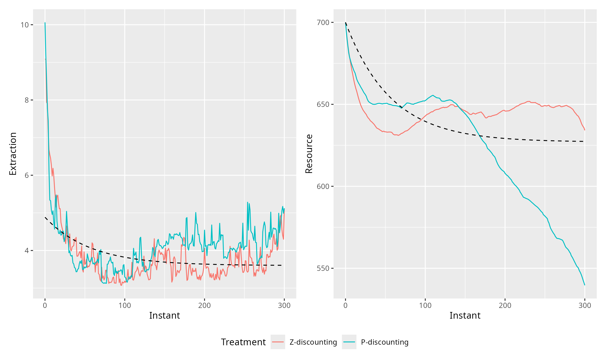

---

- **Extraction rates**: *Higher under p-discounting* compared to z-discounting. Significant deviation from the optimal extraction path in p-discounting.
- **Resource depletion**: *Faster depletion in p-discounting*. Suboptimal behavior compared to z-discounting.

**Other observations**:
- Subjects who followed optimal strategies showed no treatment effect.
- Non-optimal subjects extracted more under p-discounting.

---

### Findings and implications

- Contrary to theory, discounting reference periods affect behavior.
- Behavior is influenced by **perceived gains** rather than rational planning.
- Suggest reliance on z-discounting for better alignment with theoretical predictions.

---

## Individual and strategic behaviors 

Djiguemde, M. Dubois, D. Sauquet, A. & Tidball, M., 2022. [Individual and strategic behaviors in a dynamic extraction problem: results from a within-subject experiment in continuous time](https://doi.org/10.1080/00036846.2022.2129576). Applied Economics, pp. 1-24.

---

### Research questions 

- Do experimental subjects behave as predicted by the dynamic continuous-time model ?
- What is the impact of strategic interactions in the dynamic context ?

> We compare the observations to the theoretical behaviors, in a single agent situation (optimal control problem) and in a two-players game (differential game).

---

### Theoretical Paths

**Optimal control problem (single player):**
- The **optimal behaviour** is when the player chooses their extraction to maximize their discounted net payoffs and maintain the resource at an efficient level over time.
- The **myopic solution** is when the player only seeks to maximize their current payoff, without considering the future evolution of the resource.

---

**Game (multiple players):**
- The **social optimum** (cooperative solution) is when all players coordinate to maximize the joint discounted net payoffs, maintaining the resource at an efficient level for the group.
- The **feedback equilibrium** is when each player maximizes their own discounted net payoffs, adopting a non-cooperative strategy and taking into account the evolution of the resource.
- The **myopic solution** remains: each player maximizes only their current payoff, ignoring future consequences.

---

*Theoretical Paths in the game*
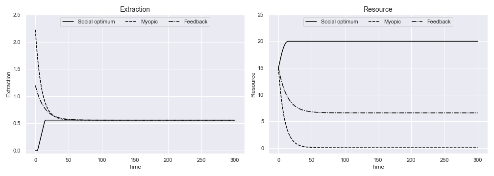

---

### Experimental design 

- Continuous-time resource extraction game, discretization rate $\tau=1$ (i.e. 1 second = 1 instant).
- Two scenarios: optimal control (single player) and game (2 players).
- Within-subject design: each participant played both scenarios.
- 2 trials round for each scenario before playing for money (learning phase).
- 5 minutes of play (300 seconds).
- 70 participants.

---

### Results

**Evolution of the resource level**

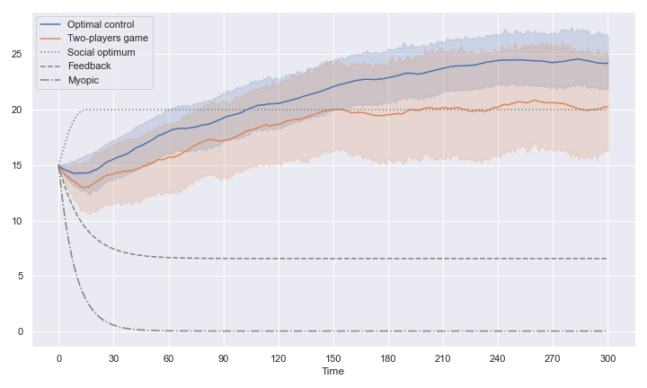

- Over-exploitation at the beginning (higher in the game).
- Greater dispersion observed in the game.

---

**Player Behavior Profiles**

- We analyzed whether individuals and groups exhibited **myopic, feedback, or optimal behavior**.
- This was based on the **Mean Squared** between the observed path and the theoretical one.
- We **classified players/groups** as "significantly" optimal, myopic, feedback, or undetermined based on their MSDs.

*We also considered the conditional MSD (with respect to the $t - 1$ resource level) and applied regressions to check that the coefficient of the conditional decisions corresponding to the lowest MSD was actually different from zero.*

---

**Optimal control problem**  

- 27.14% of participants exhibited *optimal behavior*, while 72.86% were *undetermined*.
- Upon visual inspection of the undetermined profiles, we defined new profiles: *convergent* (21.43%) and *under-exploiter* (24.29%)
- 27.14% remained *without any particular pattern*

---

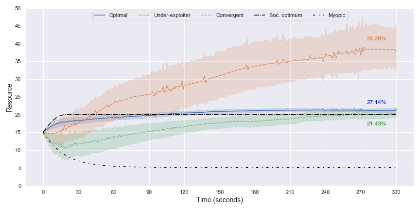

---

**Game**

- 20% of groups exhibited *optimal behavior*, while 80% were *undetermined*
- Upon visual inspection of the undetermined profiles, we defined new profiles : *convergent* (25.71%), *under-exploiter* (14.29%) and *over-exploiter* (17.14%)
- 22.86% remained *without any particular pattern*

---

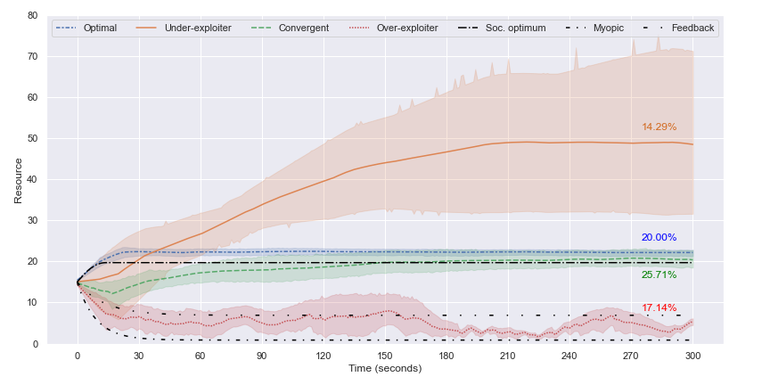

---

**Group Composition and Game Outcome**

- The composition of groups, in terms of the profiles identified in the optimal control scenario, significantly impacts the outcome of the game.
- Groups composed of players who exhibited optimal or convergent behavior in the optimal control scenario tend to perform better in the game scenario: they are more likely to coordinate their actions and achieve higher collective payoffs.

---

### Findings and implications

- As expected, **strategic interaction increases the tragedy of the common**.
- Nearly 20-25% of individuals and groups succeed in playing **significantly optimal**.
- Another 20-25% play optimally but over a finite horizon, the category we called **convergent**.
- Our findings underscore the importance of **educating players** about optimal strategies in dynamic resource management contexts.

---

- When players understand how to manage resources optimally over an infinite horizon in a **single-player scenario**, they are better equipped to handle the complexities introduced by strategic interactions in a **multi-player scenario**.
- Therefore, efforts to improve individual understanding and decision-making in dynamic resource management can have significant positive impacts on collective outcomes when strategic interactions are involved.

--- 

## Related ongoing research projects

*Davin, M., Dubois, D., Erdlenbruch, K. & Willinger, M.*

**Threshold Effects in Resource Management**
  - Examining the impact of an exogenous depletion threshold on resource sustainability. If the resource stock falls below this threshold, it will not renew, making extraction impossible.

**Impact of Predetermined Shocks on Resource Growth**
  - Studying the effects of a shock at a fixed or random date on resource availability. The shock reduces resource growth, simulating environmental changes like reduced rainfall.

---

# Intergenerational Management of Common Pool Resources

---

- Climate change, biodiversity loss, and resource depletion depend on today’s decisions. 
- Overexploitation of renewable resources threatens future welfare.
- Future generations have no agency: they cannot reciprocate, vote, or punish.  
- Cooperation with the future is a special kind of social dilemma.  

---

## The Intergenerational Goods Game (IGG)

*Hauser, Rand, Peysakhovich, Nowak (2014, Nature)*

- Successive generations of 5 players share a common pool of 100 units.
- Each player can extract 0–20 units.
- If total extraction ≤ threshold T = 50%, the pool renews to 100 units.  
- If extraction > T, the resource collapses → all future generations get 0.
- The game continues with probability $δ = 0.8$ (≈ 5 generations expected).

> **Social optimum:** 10 units per player  
> **Individual temptation:** 20 units

---

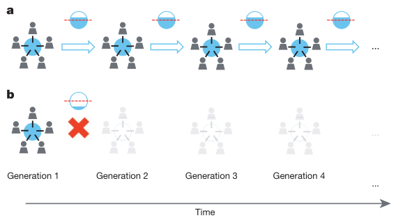

---

## Intragenerational conflict undermines cooperation with the future

*Bayle, G., Pinçon, V., Barragan-Jason, G., Bazart, C., Ibanez, L., Roussel, S., Syssau-Vaccarella, A., Dubois, D., Willinger, M.*

--- 

### Research Question

***Does intragenerational conflict undermine cooperation with the future?***

We disentangle:
- Intergenerational dilemma: present vs. future.  
- Intragenerational dilemma: conflict among current individuals.

---

### Adapted IGG

- Two treatments:
  - **1P**: one player extracts 0–60 units (intergenerational dilemma only).
  - **3P**: three players extract 0–20 units each (inter + intragenerational dilemmas).
- Renewal threshold T = 30 units (≤ 50 % of the resource).
- If extraction > T → resource collapses → all future payoffs = 0.
- No probabilistic continuation (5 generations fixed).

---

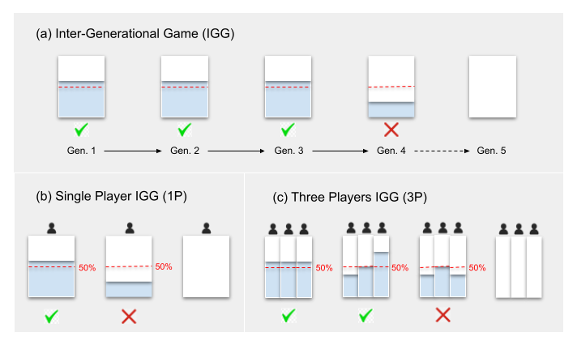

---

### Hypotheses

1. **H1:** Cooperation is higher when no intragenerational conflict exists (1P > 3P).  
2. **H2:** Intragenerational conflict reduces sustainability via coordination failures.

---

### Data collection

- During the 2024 *Nuits des chercheurs* and the 2024 *Fête de la Science* (Montpellier).
- Participants were students and general public.
- Experiment implemented on tablets.
- 5 generations (not $\delta$-probabilistic).
- No interaction between participants, they arrived sequentially → strategy method : participants took decisions for generation 1, generations 2–4, and generation 5 (no future value).
- Generations constituted ex post, after data collection.
- Participants were paid according to their extraction decisions, by bank transfer.

---

### Results

260 participants (137 in *1P* and 123 in *3P*).

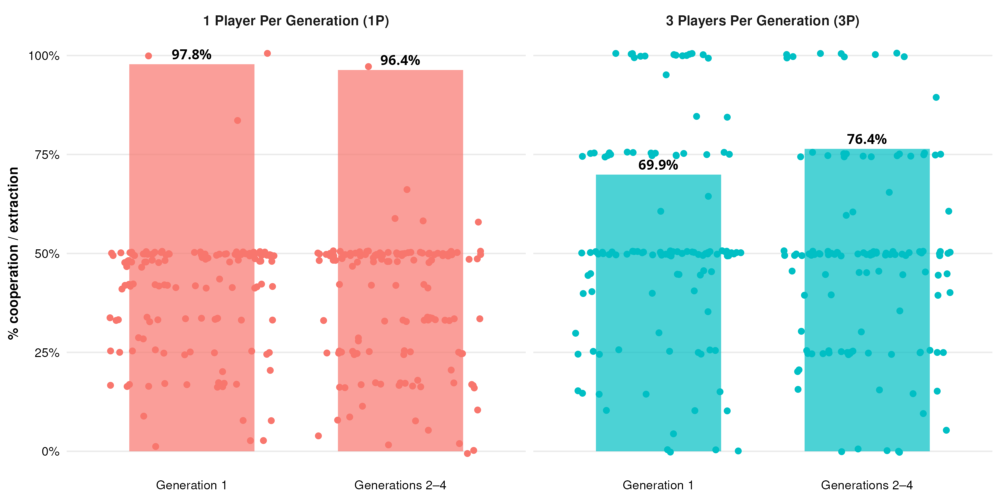

---

#### Cooperation rates

*Cooperation = 1 if extraction ≤ 30 units (renewal threshold), 0 otherwise.*

- 1P: 97–96 %.  
- 3P: 70–76 %.  

⇒ With contemporaries, cooperation collapses.

#### Extraction Distributions

- 1P: concentrated around the 50 % threshold.  
- 3P: wider variance, with both over- and under-extractors.  

---

|                         | Cooperation      | Extraction (%) |
|-------------------------|------------------|----------------|
| 1P × Gen 1 (réf.)       | 12.702$^{***}$   | 0.412$^{***}$  |
| 3P vs 1P                | -4.566$^{*}$     | 0.113$^{***}$  |
| Gen 2–4 vs Gen 1        | -1.840           | -0.039$^{***}$ |
| Interaction (3P × Gen 2–4) | 4.688$^{*}$   |                |
|                         |                  |                |
| Num. Obs.               | 520              | 520            |

*Note*: $^*$ p < 0.05, $^{**}$ p < 0.01, $^{***}$ p < 0.001

---

#### Resource sustainability

*Monte Carlo (10 000 trajectories)* to estimate the **expected survival of the resource** over five generations.

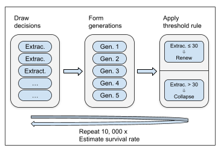

---

1. Draw decisions : Use individual extraction decisions from the experiment (1P or 3P).
2. Random generation assembly : Randomly draw participants *without replacement* to form each generation (1 or 3 players). Each trajectory = 5 successive generations.
3. Renewal rule: 
    - Resource renews if total extraction ≤ 30 units.
    - If extraction > 30 → resource collapses → all future payoffs = 0.
4. Iteration: Repeat the process 10,000 times to simulate variability in group composition and decisions.
5. Output: Compute the proportion of surviving trajectories at each generation.

---

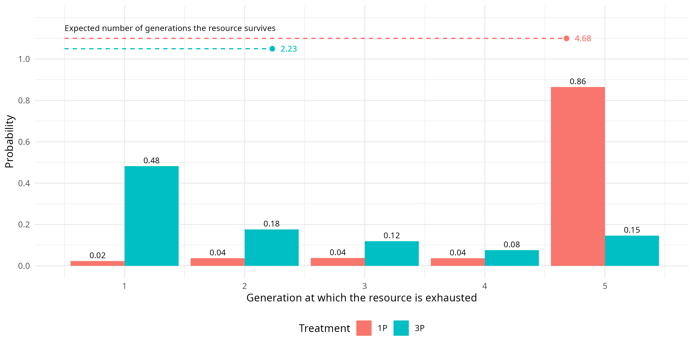

⇒ **Intragenerational conflict drastically reduces resource sustainability**.

---

### Findings and implications

- Intragenerational conflict sharply reduces cooperation and resource sustainability, as shown by lower survival rates of the resource when present.
- Effective climate and resource governance must tackle both intra- and intergenerational dilemmas: coordination among contemporaries is as important as concern for future generations.
- Addressing these challenges requires a dual strategy:
  - *Structural mechanisms* (institutions, monitoring) to reduce present-day coordination failures.
  - *Normative interventions* (future-oriented design, education) to foster long-term sustainability.

---

## Legacy or Lineage? Framing the Future for sustainability

*Barragan-Jason, G., Bayle, G., Bazart, C., Dubois, D., Ibanez, L., Pinçon, V., Roussel, S., Syssau-Vaccarella, A., Willinger, M.*

---

## Research Question

***Can behavioral framings (primings / nudges) restore concern for the future?***

---

## Conceptual distinctions

**Priming**: subtle activation of concepts, norms, or emotions that influence later behavior (Bargh 1994, Bargh et al. 1996, Bargh & Chartrand 2000).

**Framing**: explicit presentation of information that shapes how individuals interpret and respond to a choice (Tversky & Kahneman 1981, Levin et al. 1998).

**Nudges**: subtle changes in the choice architecture that alter behavior without forbidding options (Thaler & Sunstein, 2008).

---

| | **Priming** | **Framing** | **Nudge** |
|--|--------------|--------------|------------|
| **Definition** | Implicit activation of concepts or norms | Explicit presentation shaping interpretation of a choice | Contextual modification steering behavior without constraint |
| **Cognitive level** | Mostly unconscious | Conscious interpretation | Conscious / semi-conscious |
| **Focus** | Perception & associations | Meaning & perspective | Actual choice behavior |

---

|  | **Priming** | **Framing** | **Nudge** |
|--|-------------|-------------|-----------|
| **Example** | Reading “future generations” primes prosocial thinking | Framing extraction as “for 2100” or “for your descendants” | Changing default extraction or payoff display |
| **Discipline** | Cognitive psychology | Cognitive + behavioral economics | Behavioral public policy |

> Framing acts as a **bridge** between priming and nudging:  
> it shapes *how people think about the choice* rather than *what choices they face.*

---

### Four Treatments (all in 3P IGG) 

***Different Framing messages***

**Common message (all treatments):** (on the decision screen)

> Common resources, such as fish stocks or forests, are renewable — but they can be depleted if not managed sustainably. When we extract too much, these resources cannot regenerate and may disappear permanently.

**Control**: No additional message.  

**Near future** and **Close kin**
> Adopting responsible practices helps preserve these valuable resources for
  > — Future generations (up to 2100)
  > — Your close descendants (up to 2100)

---

**Self-projection treatment** (screen before decision screen)

Before making their extraction decision, participants were asked to imagine themselves as members of the next generation:

> “If you belonged to the next generation, what amount of the resource would you want your generation to extract?”

They were reminded that they did not know their actual generation (1, 2, 3, 4, or 5), the goal was to mentally adopt the perspective of those who will face the consequences.

---

### Hypotheses

1. **H1:** Framing the future (Near future, Close kin) increases cooperation compared to Control.  
2. **H2:** Self-projection enhances cooperation by fostering empathy with future generations.

Close kin > Near future > Control  
Self-projection > Control  
Future framing ? self-projection 

---

### Data collection

- During the 2024 *Nuits des chercheurs* and the 2024 *Fête de la Science* (Montpellier).
- Participants were students and general public.
- Experiment implemented on tablets.
- 5 generations (not $\delta$-probabilistic).
- No interaction between participants, they arrived sequentially → strategy method : participants took decisions for generation 1, generations 2–4, and generation 5 (no future value).
- Generations constituted ex post, after data collection.
- Participants were paid according to their extraction decisions, by bank transfer.

---

### Results

*371 participants (123 in Control, 68 in Near future, 69 in Close kin, 111 in Self-projection).*

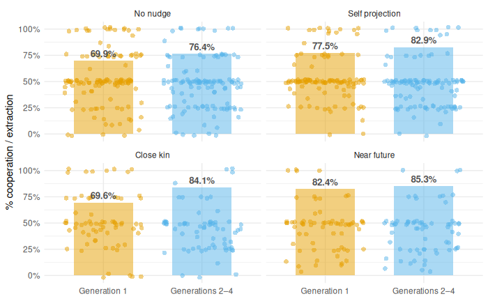

---

| Num. Obs. 742 — (371 × 2)  | Cooperation | Extraction (%) |
|----------------------------|-------------|----------------|
| No nudge (Gen 1)           | 0.843$^{***}$    | 0.532$^{***}$       |
| Self projection (Gen 1)    | 0.392       | –0.002         |
| Close kin (Gen 1)          | –0.017      | –0.012         |
| Near future (Gen 1)        | 0.697$^{+}$ | –0.071$^{*}$   |
| No nudge (Gen 2–4)         | 0.333       | –0.054$^{**}$  |
| Self projection (Gen 2–4)  | 0.009       | 0.002          |
| Close kin (Gen 2–4)        | 0.503       | –0.026         |
| Near future (Gen 2–4)      | –0.115      | 0.023          |

*Note*: $^+$ p < 0.1, $^{*}$ p < 0.05, $^{**}$ p < 0.01, $^{***}$ p < 0.001

---

*Monte Carlo (10 000 trajectories)*.

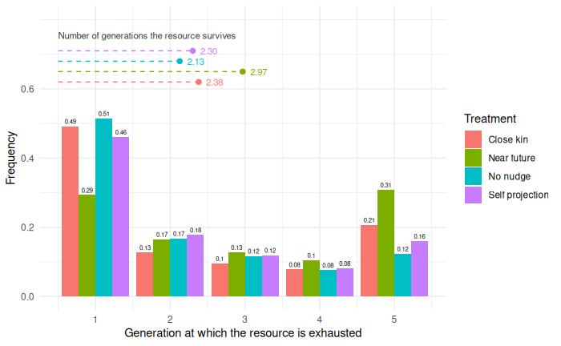

---

### Findings and implications

- Framing the future as benefiting the "near future" (up to 2100) significantly increases cooperation and resource sustainability.
- Framing the future as benefiting "close kin" does not significantly affect cooperation compared to the control.
- Self-projection does not significantly enhance cooperation compared to the control.
- Effective communication strategies should emphasize the tangible benefits of sustainable practices for the near future to foster cooperation
  and long-term resource sustainability.
- Future research should explore additional framings and interventions to further enhance cooperation with future generations.

---

# Dynamic Common Pool Resource with Spatial Externalities

---

## Mobile resources 

- **Fisheries**: Fish stocks move between fishing zones. Management involves spatial externalities, as exploitation in one area can affect stock availability in others. (Costello & Polasky 2008; Sanchirico & Wilen 1999)
- **Transboundary Aquifers**: Groundwater aquifers span multiple jurisdictions. Pumping in one region affects water availability in connected regions. (Brozovic, Sunding, & Zilberman 2010; Pfeiffer & Lin 2012)
- **Communal Pastures**: Shared grazing lands are used by multiple herders. Overgrazing in one area can degrade resources and affect neighboring areas due to herd mobility. (Ostrom 1990)

---

- **Transboundary Forests**: Forests span multiple jurisdictions, and logging in one area can affect neighboring areas, particularly concerning biodiversity and ecosystem services. (Albers & Robinson 2013).
- **Pollination and Ecosystem Services**: Pollinators (like bees) move between crop fields, and managing pollination habitats in one area can affect agricultural productivity in neighboring areas. (Ricketts et al. 2008)

---

## Theoretical Benchmark

*Based on Costello et al. (2015)*

- **Discrete Spatial Domain**: $N$ patches, each managed independently but interlinked through resource mobility.
- **Discrete Time Model**: The state of the resource and management actions are updated period by period.

---

- **Resource Growth Dynamics**: Growth function $g(e,\alpha)$ depends on the escapement $e$ (residual stock) and growth parameters $\alpha$.
- **Mobility Matrix**: $D_{ij}$ defines the fraction of resources moving from patch $i$ to patch $j$, capturing the spatial dynamics of resource movement. $D_{ii}$ refers to the retention rate.
- **Profit Function**: $\pi_{it}=p_i \times h_{it}$, where $p_i$ is the price of the resource in patch $i$ and $h_{it}$ is the harvested amount at time $t$.

---

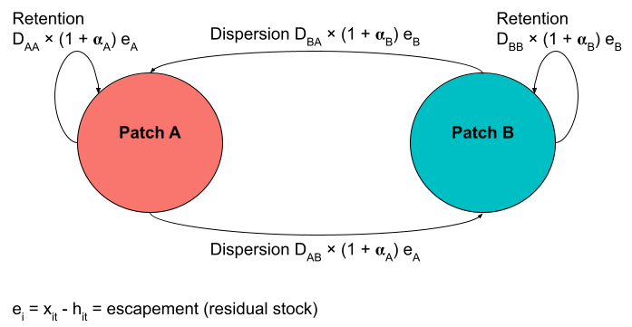

---

*Flow of resources between two patches*

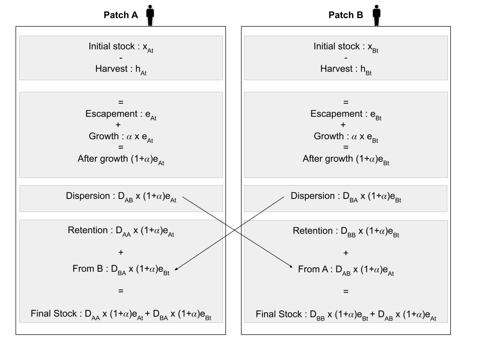

---

*Screenshot*

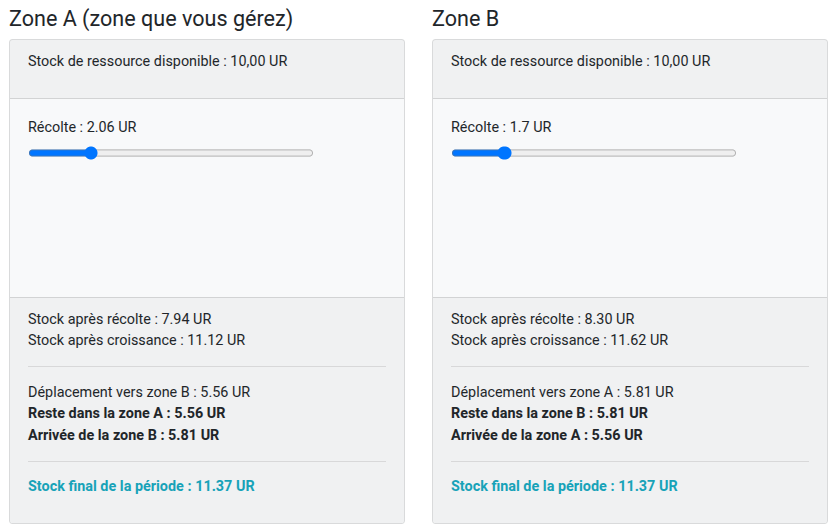

---

## Spatial Externalities and Collective Action
*Bayle, G., Dubois, D., Beaud, M., Willinger, M. & Querou, N.*.

---

### Research questions

- How spatial externalities affect the efficiency of resource management.
- Which management structures (single vs. multiple actors) lead to better resource sustainability.

---

### Theoretical predictions

- **Efficient path**: Maximizes the aggregate payoffs in both patches over the entire time horizon ⇒ Since $\alpha > 0$ the resource is conserved in both patches (zero harvest) up until the last period and entirely extracted in the last period.  

- **Decentralized (non cooperative) solution**: The subgame perfect Nash equilibrium (SPNE) depends on the marginal productivity of the patch and the number of players managing the patch  

---

**Patch marginal productivity**: retention rate × growth factor → $D_{ii} \times (1 + \alpha)$  

- If $D_{ii} \times (1 + \alpha)<1$ —**low marginal productivity**— the resource is mined in both patches initially.
- If $D_{ii} \times (1 + \alpha)<2$ —**high marginal productivity**— the number of players affects equilibrium harvests.
    - With **one player per patch** (1A-1B), the SPNE path matches the efficient path.
    - With **two players in patch B** (1A-2B), B players mine continuously, while the A players leaves the resource until the final period, then harvests all remaining stock.

---

### Hypotheses

- H1 : **Higher resource mobility decreases overall management efficiency** and increases the likelihood of over-exploitation.  
_High resource mobility implies low marginal productivity for the patch._

- H2 : **Single manager systems are more efficient and sustainable** compared to multiple manager systems.  
_If 2 players in patch B, even in case of a high marginal productivity they mine the resource in their patch._

---

### Experimental design and parameters

- Lab experiment
- 2 treatments:
    - 1A-1B : one player in patch A and one player in patch B
    - 1A-2B : one player in patch A and two players in patch B
- 3 games per session - random rematching after each game
- 1 game = 5 periods with a constant dispersion/retention rate

---

### Game parameters

- Initial resource : 10 units on each patch
- Resource growth : $\alpha = 0.4$
- Dispersion rates: ($D_{ij}$): 0.25, 0.50, 0.75 (→ Retention rates: 0.75, 0.50, 0.25)
- Order of rates across games:  
  - (0.50, 0.25, 0.75)  
  - (0.25, 0.50, 0.75)  
  - (0.75, 0.50, 0.25)  
- Resource price: $p_i = 1$ 
  → Each participant’s payoff for a game equals the total quantity harvested over the 5 periods.

---

### Hypotheses with parameters

*H1 : Higher resource mobility (lower retention rate) decreases overall management efficiency and increases the likelihood of over-exploitation*

**⇒ Total resource harvest with Dij = 0.25 > Dij = 0.50 and Dij=0.75**

*H2 : Single manager systems are more efficient and sustainable compared to multiple manager systems*  

**⇒ Total resource harvest in the single player configuration (1A-1B) > (1A-2B)**

---

**Screenshot (1A-2B)**

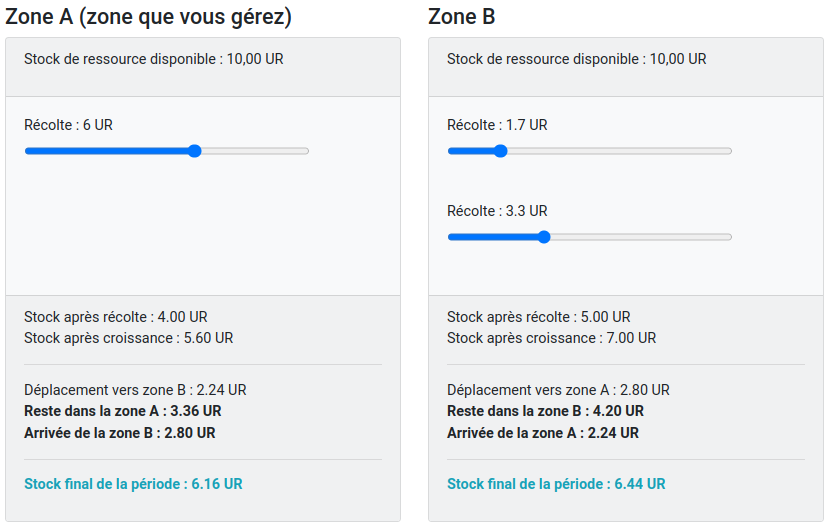

---

### Data collection

* Laboratory for Experimental Economics - Montpellier (LEEM)
* 294 participants (126 in 1A-1B and 168 in 1A-2B)

| Players per Group | # Participants | Mobility Order      | # Groups |
|-------------------|----------------|---------------------|----------|
| 2                 | 126            | 50% - 25% - 75%     | 22       |
|                   |                | 25% - 50% - 75%     | 21       |
|                   |                | 75% - 50% - 25%     | 20       |
| 3                 | 168            | 50% - 25% - 75%     | 18       |
|                   |                | 25% - 50% - 75%     | 20       |
|                   |                | 75% - 50% - 25%     | 18       |

---

### Results

*Higher resource mobility decreases overall management efficiency (H1) and single manager systems are more efficient than multiple manager systems (H2).*

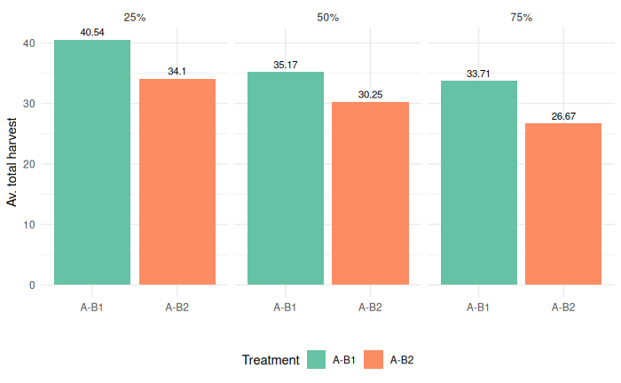

---

| Num. Obs. 357          | Total harvest |
|------------------------|---------------|
| Intercept (A-B1 & 50%) | 35.167***     |
| A-B2                   | -4.912**      |
| Mobility: 25%          | 5.372**       |
| Mobility: 75%          | -1.452        |
| Interaction A-B2 & 25% | -1.529        |
| Interaction A-B2 & 75% | -2.137        |
|                        |               |
| R2                     | 0.175         |
| R2 Adj.                | 0.164         |

$^+$ p < 0.1, $^*$ p < 0.05, $^{**}$ p < 0.01, $^{***}$ p < 0.001

---

## Findings and implications 

- Higher resource mobility decreases management efficiency and increases over-exploitation.
- Single manager systems are more efficient and sustainable than multiple manager systems.

**Implications**
- Emphasize the importance of coordinated management practices to mitigate the negative effects of resource mobility.
- Support the implementation of property rights or centralized management to enhance resource sustainability.

---

## Property Rights and Productivity
G. Bayle, D. Dubois, M. Beaud, M. Willinger & N. Quérou

---

### Research question

***How should exclusive vs. shared property rights be allocated in environments with heterogeneous resource productivity?***

---

### Property Rights and Productivity Allocation

The property regime is defined by the number of players per patch:
- 1 player (patch A) → Exclusive rights
- 2 players (patch B) → Shared rights

Location of high productivity:
- *$A_h$*: high productivity in *exclusive* patch (A)
- *$B_h$*: high productivity in *shared* patch (B)

**⇒ Do productive zones perform better under **exclusive or shared** management?**

---

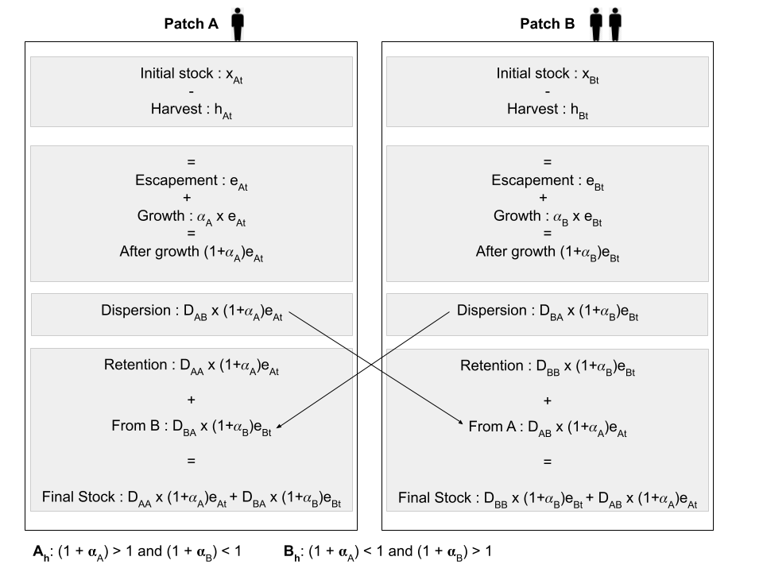

---

### Efficient vs. Strategic Extraction

- **Efficient path**: maximizes total payoff over time
  Players should let the resource grow and harvest everything in the last period ⇒ No extraction in $t < T$, full harvest in $t = T$

- **Decentralized (non-cooperative) behavior**:
  Players anticipate others' overharvesting ⇒ early and excessive extraction to preempt rivals and secure payoffs

---

### Impact of Productivity Allocation

- When *high productivity is managed by a single player*, the player can afford to be patient → behavior close to the efficient path

- When *high productivity is managed by two players*, they may rush to extract early to outcompete each other → behavior deviates from the efficient path, leading to over-extraction. This externality affects the other patch through resource mobility.

---

### Predicted outcome

| Treatment | Behavior in high-prod. patch | Efficiency |
|----------|-------------------------------|------------|
| $A_h$ (exclusive) | Conservation until $t = T$ | Higher |
| $B_h$ (shared)    | Early extraction            | Lower  |

**⇒ Exclusive rights in high-productivity areas should lead to better resource management**

---

### Experimental Setup

- Laboratory experiment
- Between-subject design with 2 treatments:
  - $A_h$: high-productivity on patch A
  - $B_h$: high-productivity on patch B
- 8 rounds per game
- N = 273 participants &ndash; $A_h$: 153, $B_h$: 120
- Control tasks: NLE, PGSM and GPS

---

### Game Parameters

- Initial stock: 10 units per patch
- $D_{ii}$ = 0.75 &ndash; Retention
- $D_{ji}$ = 0.25 &ndash; Dispersion

*Patch productivity = Retention × Growth factor*

- $(1 + \alpha)_h$ = 1.6 → High productivity ($Q=1.6 \cdot 0.75 = 1.2$)
- $(1 + \alpha)_l$ = 1.1 → Low productivity ($Q=1.1 \cdot 0.75 = 0.825$)

---

### Results

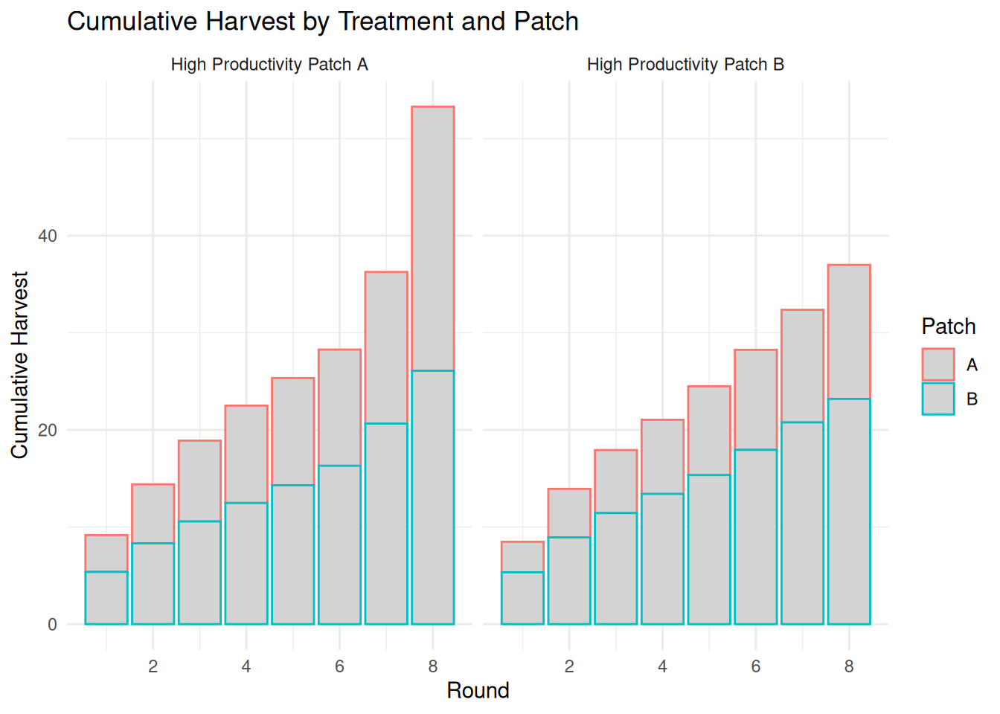

Total harvest is **higher in $A_h$ than in $B_h$** &ndash; *Mann-Whitney test p<0.05*

---

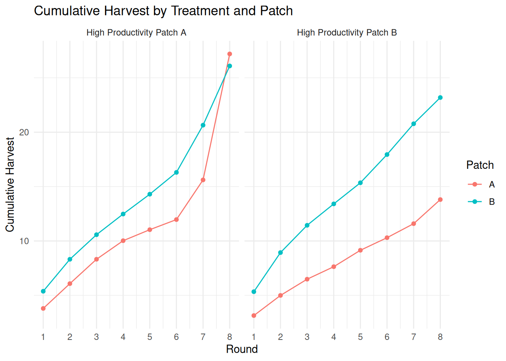

- Players in **Patch B** extract similar quantities in $A_h$ and $B_h$&ndash; *MW test p=0.663*
- In $B_h$, the player in **Patch A** extracts much less than in $A_h$ &ndash; *MW test p<0.001*

---

| Num. Obs. 1456 | Harvest   |
|----------------|-----------|
| Patch A x Ah   | 2.849***  |
| Patch A x Bh   | -1.674*** |
| Patch B x Ah   | -0.138    |
| Patch B x Bh   | 1.311*    |
| Round number   | 0.122+    |
|                |           |
| R2 Marg.       | 0.013     |
| R2 Cond.       | 0.041     |

---
Compared to Patch A x $A_h$ (ref.):
- **Patch A x $B_h$**: −1.67 units (p < 0.001) → Lower harvest in Patch A when high productivity moves to patch B
- **Patch B x $B_h$**: +1.31 units (p = 0.037) → Negative effect of the high productivity on patch B ($B_h$) is mitigated in Patch B (-1.67 + 1.31 = -0.36)

⇒ Assigning high productivity to Patch B ($B_h$) significantly reduces harvest in Patch A. However, this effect is substantially moderated in Patch B, where the harvest remains nearly stable.

---

### Findings and implications

- Exclusive rights over high-productivity areas lead to better resource conservation and higher efficiency.
- Shared management leads to early depletion and propagates negative effects to neighboring patches via resource mobility.
- Effective property rights design must account for both ecological productivity and strategic behavior.

---

## Ongoing related projects

- Introduce and study the impact of risk on the resource within the patches.
- Explore policy interventions to mitigate over-extraction.

---

# Appendix

---

## Why do we use the exponential function in discounting?

The exponential function $e^{-\rho t}$ is used in continuous-time discounting because it has key mathematical and economic properties:

- **Stationary discounting**:  
  Its decay rate is proportional to its current value:  
  $\frac{d}{dt} e^{-\rho t} = -\rho e^{-\rho t}$  
  → No memory, time-consistent discounting.

- **Limit of discrete discounting**:  
  $\lim_{n \to \infty} \left(1 + \frac{r}{n}\right)^{-nt} = e^{-rt}$

---

- **Simplifies dynamic optimization**:  
  $$
  \int_0^\infty e^{-\rho t} G(t) dt \quad \text{is tractable and interpretable.}
  $$

- **Avoids abrupt changes**:  
  Smooth and continuous decrease of value over time.

>*Future payoffs are worth less today, at a continuously decreasing rate.*

