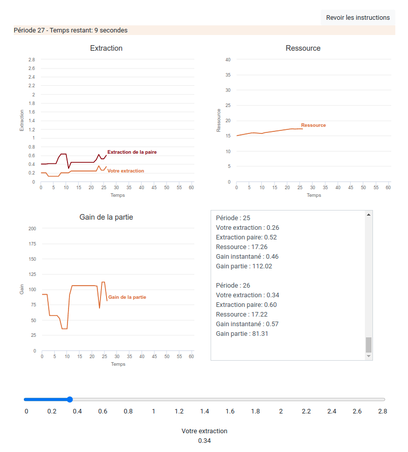

# Common Pool Resources

**Dimitri Dubois**

[https://www.duboishome.info/dimitri/cours/topics](https://www.duboishome.info/dimitri/cours/topics)

## Table of content

1. [Repeated Static CPR](#/2)
2. [Dynamic CPR](#3)
3. [Dynamic CPR with Spatial Externalities](#4)

# Introduction

| **Type of Good**        | **Rivalry**             | **Excludability**     | **Examples**                       |
|-------------------------|-------------------------|-----------------------|------------------------------------|
| **Private Goods**       | High                    | High                  | Food, clothing, personal devices  |
| **Club Goods**          | Low                     | High                  | Cinemas, private parks, toll roads|
| **Public Goods**        | Low                     | Low                   | National defense, air, public parks|
| **Common Pool Resources (CPR)** | High            | Low                   | Fisheries, groundwater, forests   |

- **Private Goods**: Both excludable and rival, meaning people can be excluded from using them, and one person's use diminishes availability for others.
- **Club Goods**: Excludable but non-rival, allowing limited access without overuse issues.
- **Public Goods**: Neither excludable nor rival, accessible to everyone without reducing availability.
- **Common Pool Resources**: Non-excludable but rival, making them susceptible to overuse and depletion. 

- CPRs are subject to the **Tragedy of the Commons** (Hardin 1968), that leads to over-extraction and depletion of the resource.
- This tragedy is not inevitable, as shown by **Ostrom**'s work on economic governance of the commons.
- Behavioral and experimental economists have also made contributions and found mechanisms that can help to mitigate the tragedy and reduce the over-exploitation, like :
    - **Communication**: Allowing users to communicate can lead to more cooperative outcomes.
    - **Sanctions**: Implementing penalties for overuse can deter individuals from over-exploiting the resource.
    - **Property rights**: Assigning property rights to the resource can give individuals or groups an incentive to manage it sustainably.
    - **Regulation**: Government regulations or quotas can limit the use of the resource and prevent over-exploitation.
    - **Nudges**: Behavioral interventions, or "nudges", can influence individuals' decisions and promote more sustainable use of the resource.

# Repeated Static Common Pool Resource

## Information sharing

Dubois, D., Farolfi, S., Rouchier, J. & Nguyen Van, P., 2020. "[Contrasting effects of information sharing on CPR extraction behaviour: experimental findings](https://journals.plos.org/plosone/article?id=10.1371/journal.pone.0240212)". Plos One 15 (10): e0241212.

- **Social information** -- the information available to participants about others' actions -- is crucial for common resource management.
- Most participants are **conditional cooperators** (Fischbacher et al. 2001), highlighting the potential influence of social information on cooperative behavior.
- **Aggregate information** about group decisions has been shown to increase contributions in public goods games. Adding **individual (anonymous) contributions** can further boost cooperation (Sell & Wilson, 1991).
- However, detailed information about others' actions can decrease cooperation, as it may reveal **free riders** within the group (Nikiforakis, 2010; Villena & Zecchetto, 2010).
- **Mixed impact of social information**: While some forms enhance cooperation, others can undermine it by exposing non-cooperative behavior.
- **Modern connected devices and social networks** facilitate information exchange, enabling real-time sharing of consumption and resource extraction data.

### Research question

**Investigate the impact of social information through voluntary sharing mechanisms on cooperative behavior in common-pool resources.**

Two Mechanisms of Information Sharing:
- **Voluntary Disclosure (VD)**: Stakeholders choose whether to disclose their extraction level.
- **Free Disclosure (FD)**: Stakeholders choose whether to disclose and **can determine the extraction level they display** (which may differ from the actual level).

### CPR Game

- Each player $i$ in a group of $N=4$ participants can extract from $y_i = 0$ to $y_i =10$ tokens from a shared resource containing $40$ tokens.
- The payoff function for each player $i$ is defined as: $\pi_i(y_i, Y) = 3y_i - 0.01875 Y^2$, where $Y = \sum y_i$ is the total extraction by all players in the group.
- The dominant strategy for each player is to extract the maximum, $y_i = 10$, regardless of others' actions.
- The collective payoff is maximized when the total extraction $Y = 20$ tokens. Achieved by each player extracting exactly $5$ tokens, balancing individual and group benefits.

### Experimental Design

- CPR game played **20 rounds** in fixed **groups of 4** participants.
- 3 treatments, following a between-subject design:
    - **_Mandatory Disclosure (MD)_**: individual extractions are disclosed in an **automatic and mandatory manner**
    - **_Voluntary Disclosure (VD)_**: after making their extraction decision, the players have to decide **whether or not** they wish to make this extraction decision public
    - **_Free Disclosure (FD)_**: after making their extraction decision, players have to decide **whether or not** they wish to make their extraction level public, as well as additionally **deciding the amount of extraction they wish to publicize**
 
  
|                          | MD | VD | FD |
|--------------------------|----|----|----|
| **Voluntary sharing**    | No | Yes | Yes |
| **Freedom to choose the value to be disclosed** | No | No  | Yes |

### Conjectures

**Conjecture 1**: Individuals disclose extractions frequently due to:
- Desire to signal cooperation (warm-glow effect).
- Perception of a "socially appropriate" extraction level and descriptive norm.

**Conjecture 2 (Voluntary Disclosure)**:
1. **Disclosed extractions** < **Non-disclosed extractions**.
2. **Average extractions** < **Mandatory Disclosure**.
   - Non-cooperators avoid making extractions public to limit influence on others.
   - Guilt or shame can deter non-prosocial behavior.

**Conjecture 3 (Free Disclosure)**:
1. **Disclosed extractions** < **Non-disclosed extractions**.
2. **Disclosed extractions** < **Actual extractions**.
3. **Average extractions** < **Mandatory Disclosure**.
   - Cooperators likely to disclose accurate extractions; non-cooperators may hide actual values.
   - Some may signal optimal extractions to set a group norm.
   - Strategic false disclosures may erode trust, hindering norm formation and conditional cooperation.

### Results
#### Average extraction

- Average extractions in MD significantly higher than in VD and FD
- No significant difference between VD and FD

#### Effect of Disclosure

- **Lower Extraction with Disclosure**: Players who disclosed their extraction decision extracted less than non-disclosers.

- **VD Treatment**: 
   - Overall average and average of disclosed extractions (displayed values) are closely aligned.
   - This alignment supports expected effects of social information: imitation, convergence of decisions, and norm formation within groups.
- **FD Treatment**:
   - A significant discrepancy between average displayed extractions and actual extractions.

#### Strategic Misreporting

- **Strategic Misreporting**: Players who misrepresented their extraction level extracted significantly more than those who reported their actual extraction or chose not to disclose.

- **Understanding of Social Optimum**: These players appeared to recognize the social optimum (5 units) as a target extraction level.
- **Emergence of Strategic Behavior**:
   - The freedom to selectively disclose favored strategic reporting.
   - Players sent misleading signals by reporting extractions near the social optimum, anticipating that others might reduce their own extraction, thus allowing the misreporters to maximize their profit.

### Findings and implications

**Effects of social information are mixed**:
    
- **VD (Voluntary Disclosure)**: Tends to **encourage cooperative actions** and more sustainable resource use. Cooperative players disclose their actions, while less cooperative players often choose not to disclose to avoid influencing others negatively. This **selective disclosure can foster a cooperative norm** by highlighting lower extractions without spreading non-cooperative behavior.
- **FD (Free Disclosure)**: Allows **strategic manipulation** of shared information. Less cooperative players can misrepresent their extractions, signaling a low, socially optimal level, while actually extracting more. This behavior can erode trust, hinder the formation of a social norm, and potentially hasten resource depletion.

**Implications**:

- Voluntary disclosure can help align actions with cooperative norms when individuals selectively disclose honest information.
- Free disclosure, however, may undermine group trust and lead to over-exploitation, as selective false reporting can mislead others and disrupt cooperative intentions within the group.

## Quality Relationships within groups

Brugnach, M., Dubois, D. & Farolfi, S.,"The Power of Bonds: How the Quality of Relationships Within a Group Can Drive Collective Actions in Common Pool Resource Management"

### Research question

- Relationships shape collective actions in social dilemmas, including CPR management.
- Managing CPRs, like water resources, benefits from cooperative actions which could be influenced by social ties and relational quality.

**Does the quality of relationships within a group impact collective management of common pool resources (CPRs)?**

_Hypothesis_: Strong, positive relationships within a group are likely to foster cooperation and responsible resource extraction.

### Building Relationships within a Group in the Lab

We developed an **effort task** (counting ones in 10x10 grids of zeros and ones) with three different payoff schemes to shape relational quality:

- **Individualistic** (control treatment): Each player is paid based on their own performance.
- **Cooperative** (promotes positive relational quality): Each player is paid based on the best performance within the group.
- **Competitive** (likely reduces relational quality): Only the player with the highest performance is paid; others receive nothing.

In all three conditions:
- Players shared **the same 100 grids**, displayed upon clicking numbers from 1 to 100.
- **Communication was allowed** in each condition.
- The task had a duration of **3 minutes**.

**Screenshot of the effort task**

### CPR Game

Adaptation of **Walker, Herr, Gardner, and Ostrom (2000)**'s game for 4 players.

- **Benefit Function:**  
  $B_i(x_i) = a x_i - b x_i^2$  
  where $x_i$ is the individual extraction, $a$ is a positive constant representing the initial benefit per unit extracted, and $b$ is a positive constant introducing diminishing returns from extraction.

- **Cost Function:**  
  $C_i(x_i, X) = x_i (c + kX)$  
  where $X = \sum_{j=1}^{n} x_j$ is the total extraction of the group, $c$ is the base cost of extraction, and $k$ is an incremental cost parameter linking the cost to total group extraction, introducing a negative externality from shared resource use.

- **Nash Equilibrium**:  
  Each player maximizes their own payoff, leading to potential overuse of the resource.  
  $x_i^{Nash} = \frac{a - c}{2b + k(n + 1)}$

- **Social Optimum**:  
  Extraction level maximizes total group payoff, balancing benefits and sustainability.  
  $x_i^{Social} = \frac{a - c}{2b + 2kn}$

- **Game Calibration**:  
    $a = 0.383$, $b = 0.001$, $c = 0.005$, $k = 0.005$:  
    **Nash Equilibrium (NE)**: 14 tokens  
    **Social Optimum (SO)**: 9 tokens

- **Conditions**:  
    **Without Communication**  
    **With Pre-Play Communication**: 3 minutes of chat before the first round.

### Questionnaire on Relational Quality

To evaluate **relational quality** within groups, a detailed questionnaire was administered:

**Emotional Experience**: Three optional open-ended questions captured participants’ immediate feelings post-task.  

**Relational Quality Dimensions**:
  - **Personal Feelings**: 16 items measuring individual feelings towards the group.
  - **Closeness-to-Others (IOS Scale)**: Using the **Inclusion of Other in Self (IOS)** scale (Gächter et al. 2015) to assess perceived closeness within the group.
  - **Behavioral Attitudes**:
    - **Towards Others**: 10 questions about participants' behaviors toward fellow group members.
    - **Perceptions of Others**: 10 questions about participants’ views on others' behaviors within the group.

**Communication Quality**: Three items assessed the perceived quality of intra-group communication during the task.

**Screenshot of the Inclusion of Other if Self (IOS)**  

### Experimental design and hypotheses

- Flow of the experiment: Effort task, questionnaires, CPR Game (10 rounds), Questionnaires.
- Between-subject design
- 248 participants
    - 88 in treatment Individualist (48 without communication and 40 with communication)
    - 80 in treatment Cooperation (44 without communication and 36 with communication)
    - 80 in treatment Competition (44 without communication and 36 with communication)

**_Hypotheses_**
- H1 : **Cooperative effort task enhances relational quality**, while competitive task diminishes it.
- H2: **Higher relational quality leads to better management** of CPRs; lower relational quality worsens CPR outcomes.

### Results

#### Link between effort task and responses to the questionnaire

1. **PCA analysis** to identify main components of the questionnaire (44 variables)
    - To **reduce** questionnaire responses **into key components** for understanding relational quality.
    - Top components reveal underlying factors.

**Players' coordinates on main axes by treatment**
- Visualization of player distributions on principal axes based on treatment (Individualistic, Cooperative, Competitive).
- Objective: To examine if the treatments correlate with distinct relational patterns identified in the PCA.

2. **K-Means clustering** of questionnaire responses:
   - **Identify distinct clusters of player experiences** within treatments, recognizing that emotions and perceptions may vary by **individual performance** and **group communication dynamics**.
   - **Methodology**: Elbow method and Silhouette score indicated **2 optimal clusters**.
   
**Cluster Visualization on PCA Components**  
Shows player distributions by clusters across main PCA axes.

- **Cluster-0**: Mostly cooperative task participants (59/124), with balanced individualist participants (41/88).
- **Cluster-1**: Primarily competitive task participants (56/124) and the remaining individualist participants (47/88).

#### Impact of Group Composition on CPR Management

Analyze CPR extraction behavior in relation to **group composition**, based on relational quality clusters.
  
**Group Composition Types**:
  - Defined by **cluster labels** assigned to each participant (Cluster-0 or Cluster-1).
  - Each group (4 players) categorized into three types:
    - **Maj. 0**: Majority of Cluster-0 participants (26 groups)
    - **Maj. 1**: Majority of Cluster-1 participants (25 groups)
    - **Mix**: Equal representation of Cluster-0 and Cluster-1 (11 groups)
  
This classification allows us to study how **relational quality** impacts CPR management, testing our hypothesis H2.

**Evolution of average CPR extraction depending on group composition**

### Findings and Implications

- Developed an **effort task** to induce diverse relational qualities.
- **Heterogeneous emotional and perceptual responses** emerged, even within the same effort task.
  - **Cluster Analysis** grouped individual profiles based on similarity rather than treatment: Identified **Cluster-0** (positive responses) and **Cluster-1** (negative responses), offering clearer insights into relational quality variations.
- **Maj. 0** groups (Cluster-0 members) had lower extractions; **Maj. 1** groups (Cluster-1 members) had higher extractions.
- **Group composition** and specific emotions impacted CPR management more than treatments alone.
- As supported in the literature, **communication** notably reduced CPR extractions.

# Dynamic Common Pool Resource

- CPRs have mainly been studied in a **static framework**: the resource is assumed to be fixed and unchanging over the course of the game. Players make decisions about how much to extract from the resource but theses decisions do not affect the future availability of the resource.
- However in reality **many CPRs are dynamic** : they regenerate over an infinite horizon of time and the extraction decisions made by players can affect the future availability of the resource.

## Theoretical Model

Based on **Rubio & Casino (2003)**

- Linear quadratic model in which two agents $i$ and $j$ exploit a renewable resource $H$, the resource can be assimilated to a groundwater
- Extraction from the resource generates a revenue $B(w) = aw -\frac{b}{2}w^2$
- Extraction has a cost $C(H, w) = max(0, c_0-c_1H)w$
    - The cost depends negatively on the level of resource $H$
    - The cost is positive when the resource level is lower than $\frac{c_0}{c_1}$ and null if equal or higher. This a piecewise function to avoid subsidy in case of a high level of resource

In the infinite horizon, the total discounted payoff is given by

$\int_{0}^{\infty}e^{-rt} \left[ aw_i(t)-\frac{b}{2}w_i(t)^{2}-\max (0,\; c_{0}-c_{1}H(t))w_i(t) \right]dt$

with $\dot H(t)=R-\alpha(w_i(t)+w_j(t))$

$r$ is the discount rate, $R$ is the natural recharge and $\alpha$ is the return flow coefficient.

**Each player's extraction reduces the resource level, affecting not only their own future payoffs but also the other player's future payoffs**. This interdependence of decisions and outcomes, inherent in CPRs, is incorporated into this dynamic equation.

**3 benchmarks**

- **Social optimum**: both players in the pair maximize the joint discounted net payoffs and maintain the resource at an efficient level (cooperative solution)
- **Feedback**: players maximize their own discounted net payoffs, they adopt a non-cooperative strategy
- **Myopic**: at each instant players maximize their current payoff regardless of the evolution of the resource

Choice of parameters such that theoretical paths are disctincts : $H_0=15, R=0.56, a=2.5, b=1.8, c_0=2, c_1=0.1, r=0.005, \alpha=1$

## Time in the lab

**Continuous time**
- In continuous time, extractions can be made at any instant and the resource evolves continuously.
- In a laboratory setting, it's necessary to **discretize the model** to facilitate the experimental process. This is because the continuous-time model would require instantaneous decision-making and feedback, which is **not feasible in a real-world setting** (exchange of information between the computer and the server).

**Discrete-time in the lab**  

In discrete time, extractions are made at **specific intervals** and the resource evolves from one interval to the next.

## Infinite Horizon in the lab

- **Incorporated into Players' Payoff Calculations:** Models long-term impact by combining **cumulative and future payoffs**.
- **Dual Payoff Components**:
  - **Cumulative Discounted Payoff**: Sum of payoffs from \( t=0 \) to \( t=p \), accounting for past actions.
  - **Future Discounted Payoff**: Projected payoff from \( t=p \) to \( t=\infty \) based on a steady extraction rate.
- Encourages players to **consider sustainable extraction rates** by making long-term consequences more salient.
- **Discounting parameter** plays a crucial role, as a higher discount rate favors **short-term gains** over sustainability, while a lower rate promotes **resource preservation**.
- **Result**: By observing cumulative and future effects, players gain a clearer understanding of the **trade-offs between current and future extraction**.

## Continuous vs. discrete time

Djiguemde, M., Dubois, D., Sauquet, A. & Tidball, M., 2022. "[Continuous Versus Discrete Time in Dynamic Common Pool Resource Game Experiments](https://doi.org/10.1007/s10640-022-00700-2)". Environmental and Resource Economics 82, pp. 985-1014.

### Conditions for comparison

- We designed two conditions to approximate continuous-time (discretization rate $\tau=0.1$) and discrete-time (discretization rate $\tau=1$) models.
- Both models are **theoretically similar** given these discretization rates
- Each condition had a total **play time of 10 minutes**:
    - Continuous-Time (CT) treatment: **600 seconds** of play, where 1 second = 0.1 instant in the model.
    - Discrete-Time (DT) treatment: **60 periods**, with 10 seconds per period. Here, 1 period = 1 instant in the model.
    - Both treatments involved **60 model instants** of play.

**_The study investigates behavioral differences in continuous vs. discrete time settings._**

      
    
<strong>Continuous Time</strong>

    
    
<strong>Discrete Time</strong>

### Experimental Design

- Between subject design
- A total of 392 participants.
- In the optimal control scenario (single player extracting from the resource), we had 202 participants: 104 in the Continuous-Time (CT) treatment and 98 in the Discrete-Time (DT) treatment.
- In the game scenario (two players extracting from the same resource), we had 190 participants: 49 pairs in the CT treatment and 46 pairs in the DT treatment.

### Results

- The resource increases in the optimal control (single player) scenario, but decreases as soon as strategic interaction is introduced.
- The nature of time does not significantly affect player behavior in individual play. 

**In the game**

- In the continuous-time treatment, players adjust their extraction rates more frequently and in smaller increments compared to the discrete-time treatment.
- In the CT treatment, players were more likely to use a "tit-for-tat" strategy, where they would match the extraction rate of the other player. In the DT treatment, players were more likely to use a "best response" strategy, where they would adjust their extraction rate based on the other player's previous extraction rate.
- Final payoffs are more unequally distributed in the DT treatment compared to the CT treatment.

### Findings and implications for resource management

- The nature of time matters when the common pool resource is played with strategic interactions between stakeholders.
- This study also makes a significant methodological contribution. We proposed a novel methodology for testing continuous-time models in a laboratory setting, despite the inherent discrete nature of such implementations. This approach allows for a more accurate representation of continuous-time dynamics and provides a framework for future experimental studies in this area.

## Discounting

Davin, M., Dubois, D., Erdlenbruch, K. & Willinger, M., 2024. "[Discounting and extraction behavior in continuous time resource experiments](https://hal.inrae.fr/hal-04477409)". CEE-M Working Paper 2024-06.

### Research question 

In dynamic games, **discounting is typically based on a reference period**.

- Theory: discounting is done at **time zero**, where agents choose optimal paths.
- Reality: in experiments, participants continuously adapt their extraction strategies.

This paper examines **how different discounting periods affect behavior** in a resource extraction experiment.  

**Theory suggests no difference** in optimal behavior based on the discounting reference period.  
However, **if subjects revise their extraction plans**, p-discounting may influence decisions.

### Difference Between z-Discounting and p-Discounting Gains

For a given payoff function $G(E_t, R_t)$, where $E_t$ is the extraction rate and $R_t$ is the resource stock at time $t$, the total discounted gains are calculated as follows (with $\rho$ the discount rate):  

**z-Discounting (time-zero discounting)**: Discounting is applied from the initial time point ($t=0 $), meaning all future payoffs are valued relative to the **initial starting time**. 
    $$
   GP_p^Z = \int_{t=0}^p e^{-\rho t} G(E_t, R_t) \, dt + \int_{t > p}^\infty e^{-\rho t} G(E_t, R_t) \, dt
   $$

**p-Discounting (present-time discounting)**: Discounting is applied relative to the **current time** $p$, meaning all payoffs are evaluated based on their value at $p$, regardless of the starting point.
   $$
   GP_p^P = \int_{t=0}^p e^{\rho (p - t)} G(E_t, R_t) \, dt + \int_{t > p}^\infty e^{-\rho (t - p)} G(E_t, R_t) \, dt
   $$

**Relationship Between z-Discounting and p-Discounting**:
   - **Conversion Factor**: $GP_p^P = GP_p^Z \times e^{\rho p}$
   - This factor $e^{\rho p}$ scales the p-discounted gains relative to the z-discounted gains. 
   - **Interpretation**: While both discounting methods aim to model long-term value, the choice of reference point (initial time vs. present time) affects perceived gain magnitude. This shift can **influence behavior**, especially in dynamic settings, as players may respond differently to nominally larger or smaller gains.

### Experimental design

- A **continuous-time** resource extraction game.
- Two parts : **optimal control** (single player) and **game** (2 players interaction). (_only optimal control analyzed in the paper_)
- **Between-subject design**
- Two treatments:
    - **z-discounting**: Gains discounted at time zero. 90 participants.
    - **p-discounting**: Gains discounted at the current time. 70 participants
- Feedback is provided on resource levels, extractions, and gains.
- **5 minutes of play** (300 secondes)
- Control tasks: Convex Time Budget (CTB, impatience), Bomb Risk Elicitation Task (BRET, risk tolerance)

### Results

- _Extraction rates_: **Higher under p-discounting** compared to z-discounting. Significant deviation from the optimal extraction path in p-discounting.
- _Resource depletion_: **Faster depletion in p-discounting**. Suboptimal behavior compared to z-discounting.

- **Subjects who followed optimal strategies showed no treatment effect**.
- Non-optimal subjects extracted more under p-discounting.

### Findings and implications

- Contrary to theory, discounting reference periods affect behavior.
- Behavior is influenced by **perceived gains** rather than rational planning.
- Suggest reliance on z-discounting for better alignment with theoretical predictions.

## Individual and strategic behaviors 

Djiguemde, M. Dubois, D. Sauquet, A. & Tidball, M., 2022. "[Individual and strategic behaviors in a dynamic extraction problem: results from a within-subject experiment in continuous time](https://doi.org/10.1080/00036846.2022.2129576)". Applied Economics, pp. 1-24.

### Research questions 

- Do experimental subjects behave as predicted by the dynamic continuous-time model ?
- What is the impact of strategic interactions in the dynamic context ?

**We compare the observations to the theoretical behaviors, in a single agent situation (optimal control problem) and in a two-players game (differential game).**

### Experimental design 

We used an experimental protocol close the one described in the previous experiment, with the following differences:

- **Within-subject design**: each participant played both the optimal control scenario and the game.
- 2 trials of the **single player** scenario before playing for money.
- 2 trials of the **two-players game** before playing for money.
- Experiment in continous-time with $\tau=1$, so that **1 second = 1 instant** in the model.
- 5 minutes of play (300 seconds).
- 70 participants.

### Results

**Evolution of the resource level**

- Over-exploitation at the beginning (higher in the game).
- Greater dispersion observed in the game.

**Player Behavior Profiles**

- We analyzed whether individuals and groups exhibited **myopic, feedback, or optimal behavior**.
- This was based on the **Mean Squared** between the observed path and the theoretical one.
- We **classified players/groups** as "significantly" optimal, myopic, feedback, or undetermined based on their MSDs.
- We also considered the conditional MSD (with respect to the $t - 1$ resource level) and applied regressions to check that the coefficient of the conditional decisions corresponding to the lowest MSD was actually different from zero.

**Optimal control problem**  

- 27.14% of participants exhibited <i>optimal</i> behavior, while 72.86% were **undetermined**.
- Upon **visual inspection** of the undetermined profiles, we defined new profiles: **convergent** (21.43%) and **under-exploiter** (24.29%)
- 27.14% remained **without any particular pattern**

**Game**

- 20% of groups exhibited **optimal behavior**, while 80% were **undetermined**
- Upon **visual inspection** of the undetermined profiles, we defined new profiles : **convergent** (25.71%), **under-exploiter** (14.29%) and **over-exploiter** (17.14%)
- 22.86% remained **without any particular pattern**

**Group Composition and Game Outcome**

- The composition of groups, in terms of the profiles identified in the optimal control scenario, significantly impacts the outcome of the game.
- Groups composed of players who exhibited optimal or convergent behavior in the optimal control scenario tend to perform better in the game scenario: they are more likely to coordinate their actions and achieve higher collective payoffs.

### Findings and implications for resource management

- As expected, **strategic interaction increases the tragedy of the common**.
- Nearly 20-25% of individuals and groups succeed in playing **significantly optimal**.
- Another 20-25% play optimally but over a finite horizon, the category we called **convergent**.
- Our findings underscore the importance of **educating players** about optimal strategies in dynamic resource management contexts.
- When players understand how to manage resources optimally over an infinite horizon in a **single-player scenario**, they are better equipped to handle the complexities introduced by strategic interactions in a **multi-player scenario**.
- Therefore, efforts to improve individual understanding and decision-making in dynamic resource management can have significant positive impacts on collective outcomes when strategic interactions are involved.

## Ongoing Research Questions and Projects

**Threshold Effects in Resource Management**
  - Examining the impact of an exogenous depletion threshold on resource sustainability.
  - If the resource stock falls below this threshold, it will not renew, making extraction impossible.

**Impact of Predetermined Shocks on Resource Growth**
  - Studying the effects of a shock at a fixed or random date on resource availability.
  - The shock reduces resource growth, simulating environmental changes like reduced rainfall.

**Intergenerational Management of Common Pool Resources (CPR)**
  - Investigating decision-making and resource extraction behavior across generations.
  - Focus on sustainability strategies and knowledge transfer between successive stakeholders.

# Dynamic Common Pool Resource with Spatial Externalities

Bayle, G., Dubois, D., Beaud, M., Willinger, M. & Querou, N., "Managing Mobile Common Pool Resources: An Experimental Investigation of Spatial Externalities and Collective Action".

## Research questions

- How natural resources, which **move between different management zones**, can be effectively managed. 
- Understand the dynamics of resource management and exploitation in a context where resources are mobile.

**Impact of Spatial Externalities**: Examine how spatial externalities affect the efficiency of resource management. Spatial externalities occur when resource exploitation in one area impacts the availability and quality of resources in neighboring areas.

**Comparison of Management Structures**: Compare single-actor management with shared management by multiple actors to determine which structure minimizes conflicts and maximizes resource sustainability.

## Mobile resources 

- **Fisheries**: Fish stocks move between fishing zones. Management involves spatial externalities, as exploitation in one area can affect stock availability in others. (Costello & Polasky 2008; Sanchirico & Wilen 1999)
- **Transboundary Aquifers**: Groundwater aquifers span multiple jurisdictions. Pumping in one region affects water availability in connected regions. (Brozovic, Sunding, & Zilberman 2010; Pfeiffer & Lin 2012)
- **Communal Pastures**: Shared grazing lands are used by multiple herders. Overgrazing in one area can degrade resources and affect neighboring areas due to herd mobility. (Ostrom 1990)
- **Transboundary Forests**: Forests span multiple jurisdictions, and logging in one area can affect neighboring areas, particularly concerning biodiversity and ecosystem services. (Albers & Robinson 2013).
- **Pollination and Ecosystem Services**: Pollinators (like bees) move between crop fields, and managing pollination habitats in one area can affect agricultural productivity in neighboring areas. (Ricketts et al. 2008)

## Theoretical Model

_Based on Costello et al. (2015)_

- **Discrete Spatial Domain**: N patches, each managed independently but interlinked through resource mobility.
- **Discrete Time Model**: The state of the resource and management actions are updated period by period.
- **Resource Growth Dynamics**: Growth function $g(e,\alpha)$ depends on the escapement $e$ (residual stock) and growth parameters $\alpha$.
- **Mobility Matrix**: $D_{ij}$ defines the fraction of resources moving from patch $i$ to patch $j$, capturing the spatial dynamics of resource movement. $D_{ii}$ refers to the retention rate.
- **Profit Function**: $\pi_{it}=p_i \times h_{it}$, where $p_i$ is the price of the resource in patch $i$ and $h_{it}$ is the harvested amount at time $t$.

**Impact of Spatial Externalities and Management Structure**

    

    

## Theoretical predictions

**Efficient path maximizing the aggregate payoffs in both patches over the entire time horizon**: Since $\alpha > 0$ the resource is conserved in both patches (zero harvest) up until the last period and entirely extracted in the last period.  

**Under decentralized (non cooperative) management**, the subgame perfect Nash equilibrium (SPNE) depends on the **marginal productivity** of the patch and the **number of players managing the patch**  

Patch marginal productivity (retention rate x growth factor) : $D_{ii} \times (1 + \alpha)$  

- If $D_{ii} \times (1 + \alpha)<1$ (**low marginal productivity**), the resource is mined in both patches initially.
- If $D_{ii} \times (1 + \alpha)<2$ (**high marginal productivity**), the number of players affects equilibrium harvests.
    - With **one player per patch** (1A-1B), the SPNE path matches the efficient path.
    - With **two players in patch B** (1A-2B), B players mine continuously, while the A players leaves the resource until the final period, then harvests all remaining stock.

- H1 : **Higher resource mobility decreases overall management efficiency** and increases the likelihood of over-exploitation.  
_High resource mobility implies low marginal productivity for the patch._

- H2 : **Single manager systems are more efficient and sustainable** compared to multiple manager systems.  
_If 2 players in patch B, even in case of a high marginal productivity they mine the resource in their patch._

## Experimental design and parameters

- Initial resource : 10 units on each patch
- **Resource growth** : $\alpha = 0.4$
- **Dispersion rates** : $D_{ij}$ = 0.25, 0.5, 0.75 | **Retention rates** :  $D_{ii}$ = 0.75, 0.50, 0.25
- Group-compositions : **1A-1B** and **1A-2B**
- 1 game = 5 periods with a constant dispersion/retention rate
- 3 games per session - random rematching after each game
- **3 different orders for the dispersion/retention rate** : (0.50, 0.25, 0.75); (0.25, 0.50, 0.75); (0.75, 0.50, 0.25)

**Theoretical predictions with the parameters**

_H1 : Higher resource mobility (lower retention rate) decreases overall management efficiency and increases the likelihood of over-exploitation_   
**Total resource harvest with Dij = 0.25 > Dij = 0.50 and Dij=0.75**

_H2 : Single manager systems are more efficient and sustainable compared to multiple manager systems_  
**Total resource harvest 1A-1B > 1A-2B**

**Screenshot (1A-2B)**

**Data collected in the Laboratory for Experimental Economics - Montpellier**

| Players per Group | # Participants | Mobility Order       | # Groups |
|-------------------|----------------|----------------------|----------|
| 2                 | 126            | 50% - 25% - 75%     | 22       |
|                   |                | 25% - 50% - 75%     | 21       |
|                   |                | 75% - 50% - 25%     | 20       |
| 3                 | 168            | 50% - 25% - 75%     | 18       |
|                   |                | 25% - 50% - 75%     | 20       |
|                   |                | 75% - 50% - 25%     | 18       |

## Results

**Higher resource mobility decreases overall management efficiency and single manager systems are more efficient than multiple manager systems.**

## Findings and implications 

- Higher resource mobility decreases management efficiency and increases over-exploitation.
- Single manager systems are more efficient and sustainable than multiple manager systems.

**Implications**
- Emphasize the importance of coordinated management practices to mitigate the negative effects of resource mobility.
- Support the implementation of property rights or centralized management to enhance resource sustainability.

**Ongoing Research**
- Investigate the effects of asymmetry in the marginal productivity of the patches.
- Introduce and study the impact of risk on the resource within the patches.
